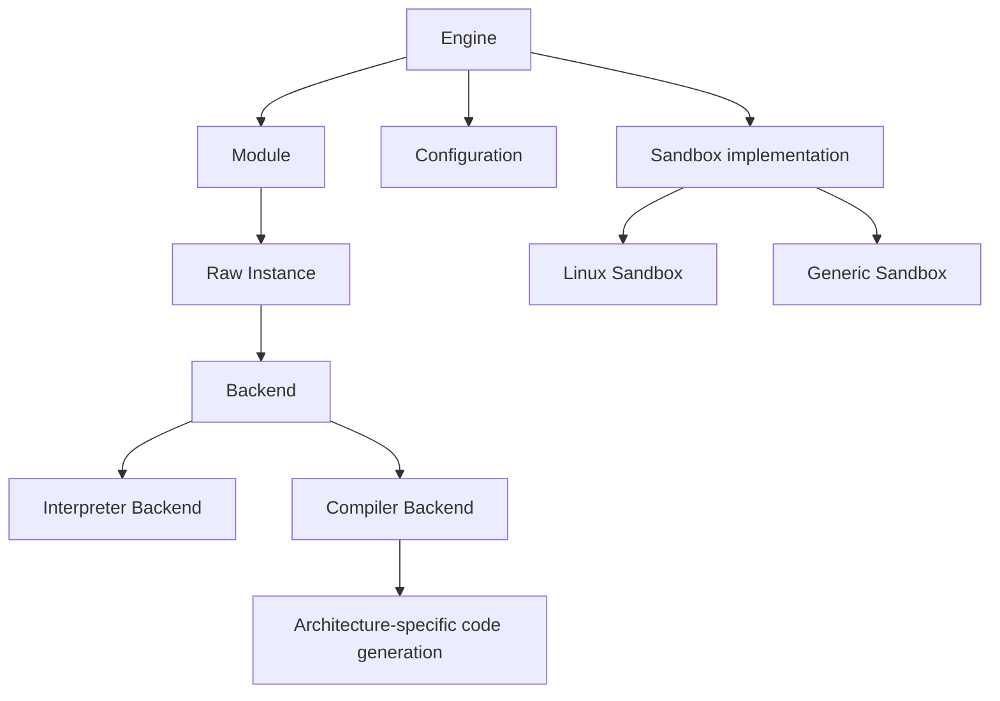
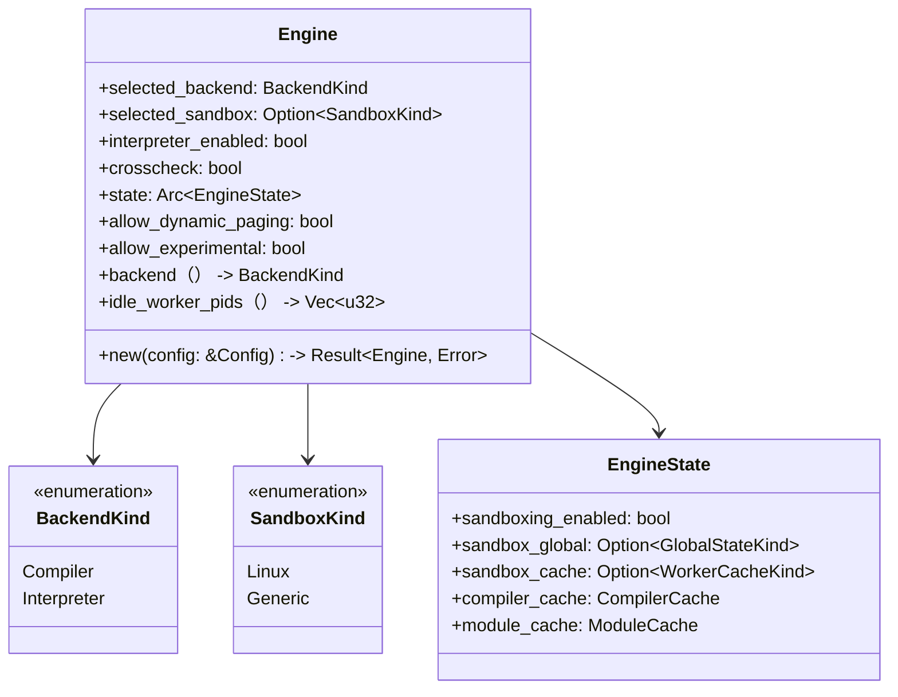
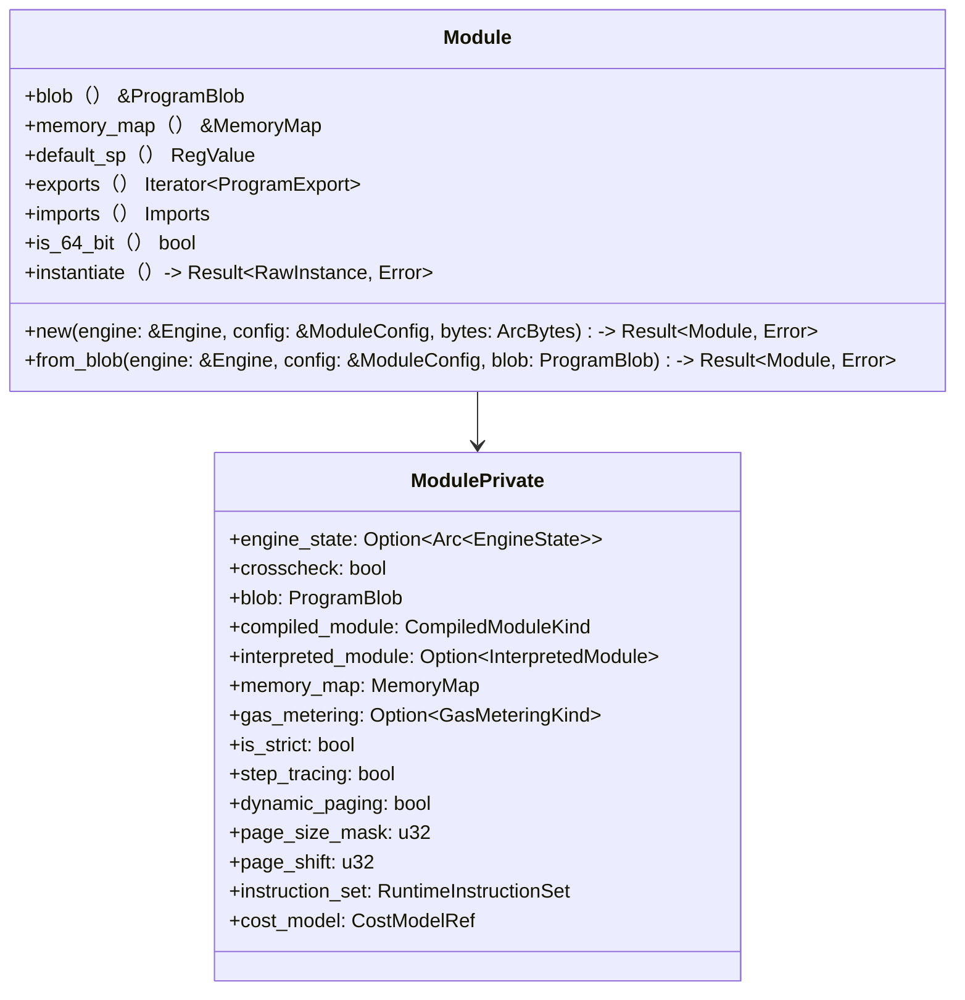
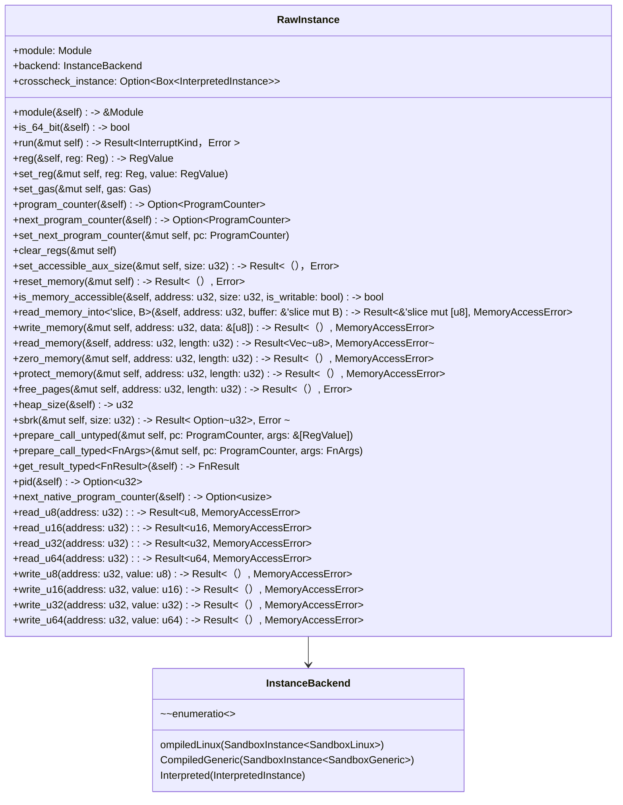
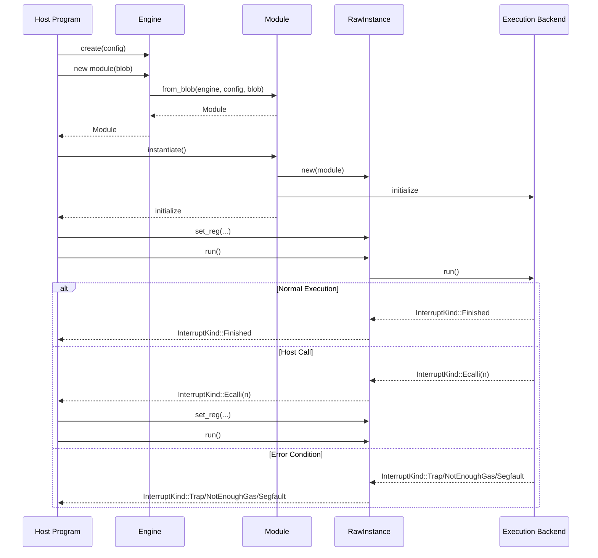
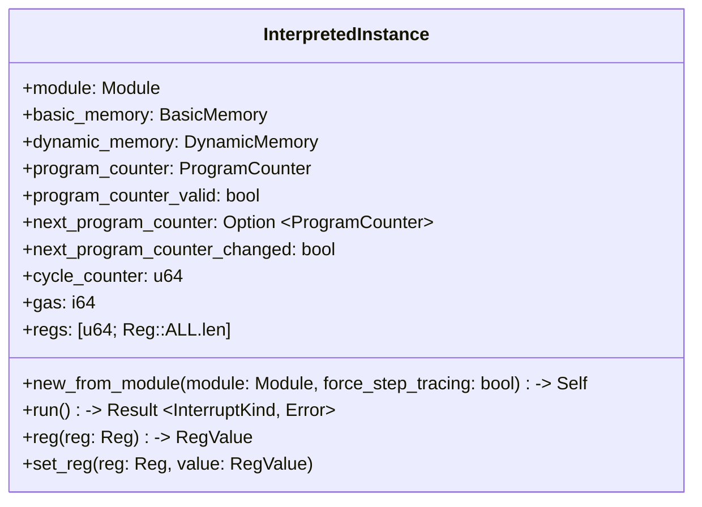
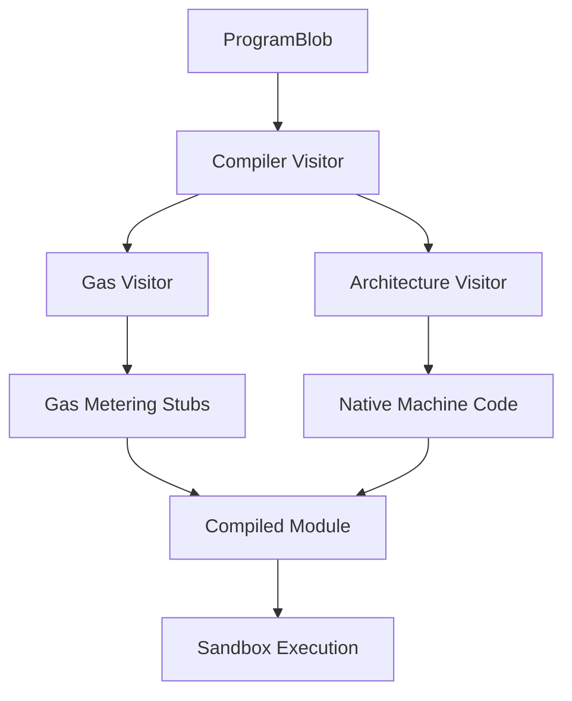
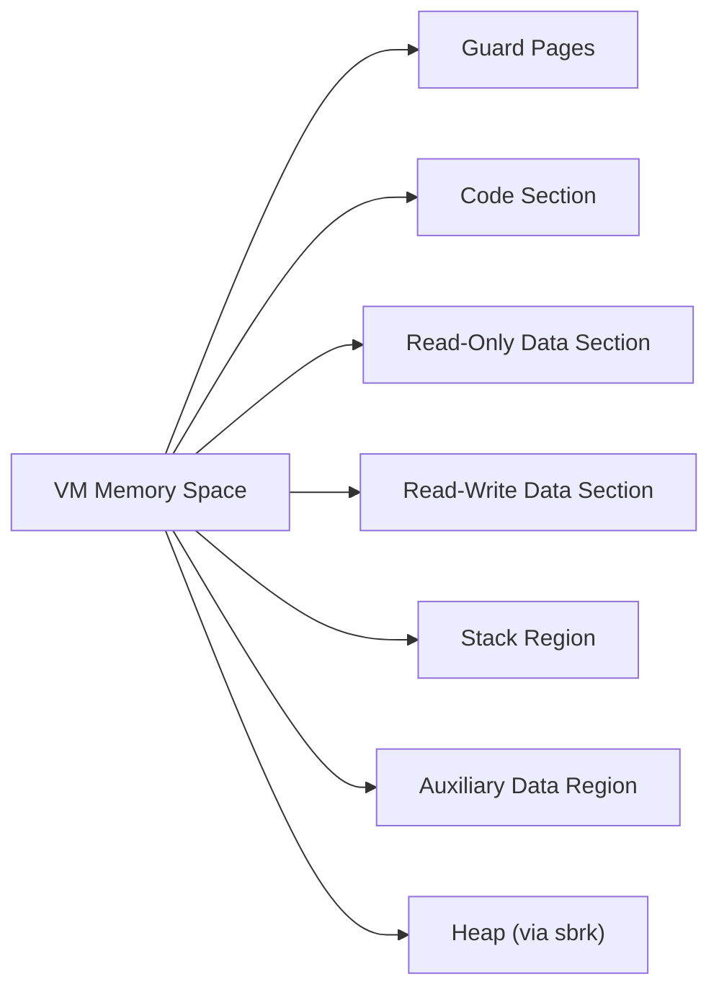
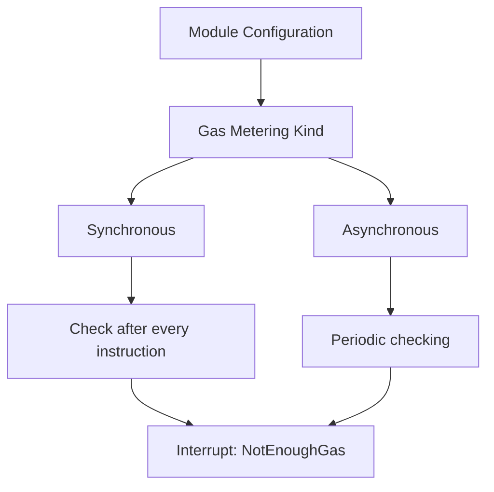

The Core VM Engine is the central execution system of PolkaVM, responsible for loading, compiling, and running guest programs in a secure and efficient manner. It provides the foundation for program execution, memory management, sandboxing, and interaction between host and guest code. For information about program representation, see [Program Representation](), and for the sandboxing system, see [Sandboxing](https://iurdao.github.io/technics/2025/05/24/Sandboxing.html).

## Architecture Overview

The Core VM Engine consists of several key components that work together to enable secure and efficient execution of programs.

Sources: [crates/polkavm/src/api.rs96-234](https://github.com/paritytech/polkavm/blob/910adbda/crates/polkavm/src/api.rs#L96-L234) [crates/polkavm/src/api.rs962-2044](https://github.com/paritytech/polkavm/blob/910adbda/crates/polkavm/src/api.rs#L962-L2044) [crates/polkavm/src/lib.rs1-172](https://github.com/paritytech/polkavm/blob/910adbda/crates/polkavm/src/lib.rs#L1-L172)

## Key Components

### Engine

The `Engine` is the main entry point for using PolkaVM. It holds global state and configuration, and is responsible for creating new modules and managing sandbox workers.

Sources: [crates/polkavm/src/api.rs96-234](https://github.com/paritytech/polkavm/blob/910adbda/crates/polkavm/src/api.rs#L96-L234) [crates/polkavm/src/config.rs7-49](https://github.com/paritytech/polkavm/blob/910adbda/crates/polkavm/src/config.rs#L7-L49) [crates/polkavm/src/config.rs51-85](https://github.com/paritytech/polkavm/blob/910adbda/crates/polkavm/src/config.rs#L51-L85)

### Module

A `Module` represents a compiled program that can be instantiated for execution. It contains the program code, memory layout, and metadata about exports and imports.

Sources: [crates/polkavm/src/api.rs258-780](https://github.com/paritytech/polkavm/blob/910adbda/crates/polkavm/src/api.rs#L258-L780) [crates/polkavm/src/api.rs386-655](https://github.com/paritytech/polkavm/blob/910adbda/crates/polkavm/src/api.rs#L386-L655)

### RawInstance

A `RawInstance` is an instantiated module that can be executed. It holds the execution state including registers, memory, and a pointer to the current instruction.

Sources: [crates/polkavm/src/api.rs962-2044](https://github.com/paritytech/polkavm/blob/910adbda/crates/polkavm/src/api.rs#L962-L2044) [crates/polkavm/src/api.rs859-873](https://github.com/paritytech/polkavm/blob/910adbda/crates/polkavm/src/api.rs#L859-L873)

## Execution Flow

The execution flow of the Core VM Engine encompasses program loading, instantiation, and the execution cycle.

Sources: [crates/polkavm/src/api.rs386-655](https://github.com/paritytech/polkavm/blob/910adbda/crates/polkavm/src/api.rs#L386-L655) [crates/polkavm/src/api.rs962-2044](https://github.com/paritytech/polkavm/blob/910adbda/crates/polkavm/src/api.rs#L962-L2044) [crates/polkavm/src/utils.rs103-139](https://github.com/paritytech/polkavm/blob/910adbda/crates/polkavm/src/utils.rs#L103-L139)

### Instantiation Process

When a module is instantiated:

1. The engine selects the appropriate backend (Compiler or Interpreter)
2. If the Compiler backend is selected, the VM instructions are compiled to native code
3. If sandboxing is enabled, a sandbox environment is prepared
4. A RawInstance is created, linked to the appropriate backend
5. Memory is allocated according to the module's memory map

### Execution Cycle

The execution cycle involves:

1. Setting up the initial state (registers, program counter)
2. Running the code via the selected backend
3. Handling interrupts that occur during execution
4. Returning control to the host when necessary (for host calls or on completion)

### Interrupt Types

The VM uses interrupts to handle various execution events:

| Interrupt Type | Description             | Trigger                                                  |
| -------------- | ----------------------- | -------------------------------------------------------- |
| Finished       | Normal termination      | Program jumps to `VM_ADDR_RETURN_TO_HOST`                |
| Trap           | Abnormal termination    | Invalid instruction, jump, or explicit trap              |
| Ecalli         | Host function call      | `ecalli` instruction executed                            |
| NotEnoughGas   | Gas limit exceeded      | Gas counter reaches zero                                 |
| Segfault       | Memory access violation | Accessing unmapped memory or writing to read-only memory |
| Step           | Single step completed   | Step tracing is enabled                                  |

Sources: [crates/polkavm/src/utils.rs103-139](https://github.com/paritytech/polkavm/blob/910adbda/crates/polkavm/src/utils.rs#L103-L139) [crates/polkavm/src/tests.rs365-375](https://github.com/paritytech/polkavm/blob/910adbda/crates/polkavm/src/tests.rs#L365-L375)

## Backends

The Core VM Engine supports two execution backends:

### Interpreter Backend

The Interpreter backend executes instructions one by one, interpreting each instruction as it runs. It's implemented in `InterpretedInstance`:

Sources: [crates/polkavm/src/interpreter.rs397-752](https://github.com/paritytech/polkavm/blob/910adbda/crates/polkavm/src/interpreter.rs#L397-L752) [crates/polkavm/src/interpreter.rs1-20](https://github.com/paritytech/polkavm/blob/910adbda/crates/polkavm/src/interpreter.rs#L1-L20)

### Compiler Backend

The Compiler backend translates the VM instructions to native machine code, which is executed directly by the CPU. This provides better performance but is more complex and requires platform-specific optimizations:

Sources: [crates/polkavm/src/api.rs237-256](https://github.com/paritytech/polkavm/blob/910adbda/crates/polkavm/src/api.rs#L237-L256) [crates/polkavm/src/api.rs496-575](https://github.com/paritytech/polkavm/blob/910adbda/crates/polkavm/src/api.rs#L496-L575)

## Memory Management

The VM has a well-defined memory layout to ensure security and proper isolation:

The memory layout is configured by the `MemoryMap` which defines the address ranges for each section:

| Section         | Purpose                            | Access                 |
| --------------- | ---------------------------------- | ---------------------- |
| Code Section    | Contains executable instructions   | Read-only              |
| Read-Only Data  | Constants and immutable data       | Read-only              |
| Read-Write Data | Global variables and mutable data  | Read-write             |
| Stack           | Function calls and local variables | Read-write             |
| Auxiliary Data  | Host-configurable data region      | Read-write (from host) |
| Heap            | Dynamically allocated memory       | Read-write             |

Sources: [crates/polkavm/src/api.rs594-623](https://github.com/paritytech/polkavm/blob/910adbda/crates/polkavm/src/api.rs#L594-L623) [crates/polkavm/src/interpreter.rs79-133](https://github.com/paritytech/polkavm/blob/910adbda/crates/polkavm/src/interpreter.rs#L79-L133)

### Dynamic Paging

When enabled, dynamic paging allows memory to be mapped on-demand:

1. Pages are only allocated when accessed
2. Attempting to access an unmapped page triggers a `Segfault` interrupt
3. The host can map new pages or protect pages as needed
4. Useful for memory-efficient execution of large programs

Sources: [crates/polkavm/src/interpreter.rs250-282](https://github.com/paritytech/polkavm/blob/910adbda/crates/polkavm/src/interpreter.rs#L250-L282) [crates/polkavm/src/config.rs458-471](https://github.com/paritytech/polkavm/blob/910adbda/crates/polkavm/src/config.rs#L458-L471)

## Configuration

### Engine Configuration

The `Config` struct controls engine-level settings:

| Setting                | Description                              | Default                          |
| ---------------------- | ---------------------------------------- | -------------------------------- |
| `backend`              | Execution backend (Compiler/Interpreter) | Best available                   |
| `sandbox`              | Sandbox implementation (Linux/Generic)   | Best available                   |
| `crosscheck`           | Enable execution cross-checking          | false                            |
| `allow_experimental`   | Enable experimental features             | false                            |
| `allow_dynamic_paging` | Enable dynamic paging                    | false                            |
| `worker_count`         | Number of worker sandboxes               | 2                                |
| `cache_enabled`        | Enable module caching                    | true (with module-cache feature) |
| `sandboxing_enabled`   | Enable security sandboxing               | true                             |

Sources: [crates/polkavm/src/config.rs100-217](https://github.com/paritytech/polkavm/blob/910adbda/crates/polkavm/src/config.rs#L100-L217) [crates/polkavm/src/config.rs152-366](https://github.com/paritytech/polkavm/blob/910adbda/crates/polkavm/src/config.rs#L152-L366)

### Module Configuration

The `ModuleConfig` struct controls module-level settings:

| Setting          | Description                               | Default          |
| ---------------- | ----------------------------------------- | ---------------- |
| `page_size`      | Memory page size                          | 4096 (4K)        |
| `gas_metering`   | Gas metering type (None/Sync/Async)       | None             |
| `is_strict`      | Enable strict mode for validation         | false            |
| `step_tracing`   | Enable instruction-by-instruction tracing | false            |
| `dynamic_paging` | Enable dynamic paging for this module     | false            |
| `aux_data_size`  | Size of auxiliary data region             | 0                |
| `allow_sbrk`     | Allow dynamic heap allocation             | true             |
| `cost_model`     | Gas cost model                            | Naive cost model |

Sources: [crates/polkavm/src/config.rs392-583](https://github.com/paritytech/polkavm/blob/910adbda/crates/polkavm/src/config.rs#L392-L583) [crates/polkavm/src/config.rs413-427](https://github.com/paritytech/polkavm/blob/910adbda/crates/polkavm/src/config.rs#L413-L427)

## Gas Metering

Gas metering limits the computational resources a program can use:

### Gas Metering Types

* **Synchronous**: Checks gas after every instruction. Precise but higher overhead.
* **Asynchronous**: Checks gas periodically. Lower overhead but less precise timing of interruption.

Sources: [crates/polkavm/src/config.rs369-385](https://github.com/paritytech/polkavm/blob/910adbda/crates/polkavm/src/config.rs#L369-L385) [crates/polkavm/src/api.rs361-365](https://github.com/paritytech/polkavm/blob/910adbda/crates/polkavm/src/api.rs#L361-L365)

## Security Considerations

### Sandboxing

The Core VM Engine provides security through sandboxing:

* **Linux Sandbox**: Uses Linux-specific security features (seccomp, namespaces)
* **Generic Sandbox**: Uses signal handlers for basic protection (less secure, considered experimental)

### Memory Protection

Memory protection ensures that:

* Code and read-only data cannot be modified
* Out-of-bounds memory access is prevented
* Stack overflows are caught
* Guard pages isolate different memory regions

Sources: [crates/polkavm/src/api.rs153-188](https://github.com/paritytech/polkavm/blob/910adbda/crates/polkavm/src/api.rs#L153-L188) [crates/polkavm/src/config.rs357-366](https://github.com/paritytech/polkavm/blob/910adbda/crates/polkavm/src/config.rs#L357-L366)

## Error Handling

The VM uses a comprehensive error handling system:

1. The `Error` type encapsulates various error kinds
2. The `InterruptKind` enum represents different types of execution interrupts
3. The `MemoryAccessError` handles memory access failures

Sources: [crates/polkavm/src/error.rs19-108](https://github.com/paritytech/polkavm/blob/910adbda/crates/polkavm/src/error.rs#L19-L108) [crates/polkavm/src/utils.rs103-139](https://github.com/paritytech/polkavm/blob/910adbda/crates/polkavm/src/utils.rs#L103-L139) [crates/polkavm/src/api.rs876-909](https://github.com/paritytech/polkavm/blob/910adbda/crates/polkavm/src/api.rs#L876-L909)
