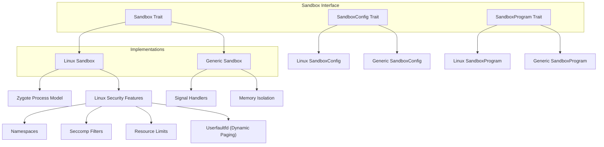
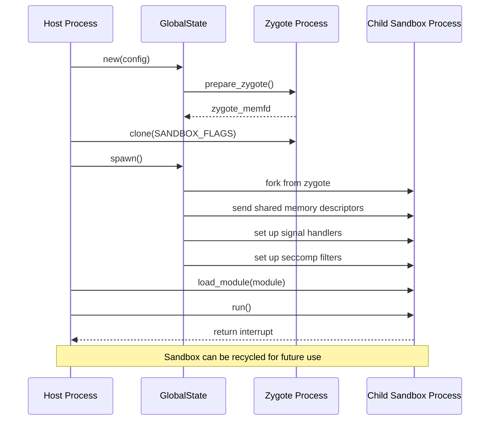
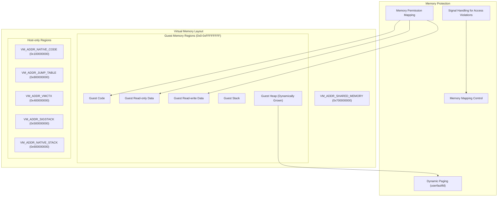
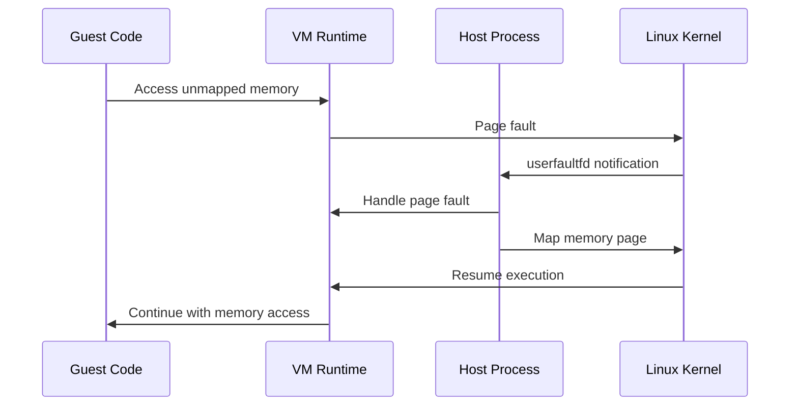
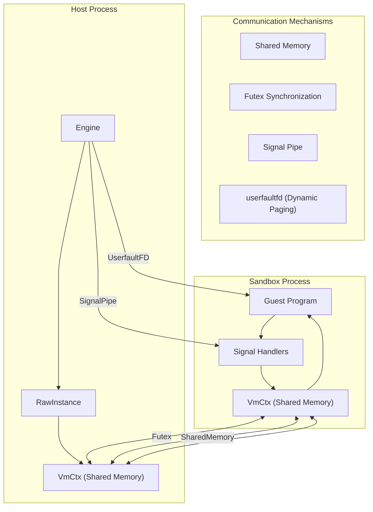

Sandboxing is a critical security feature in PolkaVM that isolates guest program execution from the host system. This isolation is essential for preventing malicious or erroneous code from affecting the host environment or accessing unauthorized resources. This document explains how PolkaVM implements sandboxing, the different sandbox implementations available, and the security mechanisms they employ.

For information about how program code is executed within the sandbox, see [Core VM Engine](https://iurdao.github.io/technics/2025/05/24/Inside-PolkaVM-Unveiling-the-Core-VM-Engine.html).

## Architecture Overview

PolkaVM implements a trait-based architecture for sandboxing, with specialized implementations for different operating systems. The system is designed to be extensible while providing secure isolation guarantees.

Sources: [crates/polkavm/src/sandbox.rs88-138](https://github.com/paritytech/polkavm/blob/910adbda/crates/polkavm/src/sandbox.rs#L88-L138) [crates/polkavm/src/sandbox/linux.rs37-192](https://github.com/paritytech/polkavm/blob/910adbda/crates/polkavm/src/sandbox/linux.rs#L37-L192) [crates/polkavm/src/sandbox/generic.rs92-139](https://github.com/paritytech/polkavm/blob/910adbda/crates/polkavm/src/sandbox/generic.rs#L92-L139)

## Sandbox Interface

The `Sandbox` trait defines a common interface for all sandbox implementations. It specifies methods for:

* Creating and managing sandbox instances
* Loading compiled modules
* Executing code within the sandbox
* Accessing and manipulating memory and registers
* Handling interrupts and traps

The trait ensures that different sandboxing implementations can be used interchangeably while providing the same level of functionality.

Sources: [crates/polkavm/src/sandbox.rs88-138](https://github.com/paritytech/polkavm/blob/910adbda/crates/polkavm/src/sandbox.rs#L88-L138) [crates/polkavm/src/sandbox.rs152-223](https://github.com/paritytech/polkavm/blob/910adbda/crates/polkavm/src/sandbox.rs#L152-L223) [crates/polkavm/src/sandbox.rs321-424](https://github.com/paritytech/polkavm/blob/910adbda/crates/polkavm/src/sandbox.rs#L321-L424)

## Linux Sandbox Implementation

The Linux sandbox implementation leverages the advanced security features available in the Linux kernel to provide strong isolation guarantees.

### Zygote Process Model

The Linux sandbox uses a "zygote" process model, where a master process (the zygote) is forked to create child processes that execute guest code. This approach allows for:

1. Fast creation of new sandbox instances
2. Strong process-level isolation
3. Efficient resource management

The zygote process is created with a carefully controlled environment, and when a new sandbox is needed, the zygote is forked to create a new process. This new process inherits the initialized state but runs with its own memory space and restricted permissions.

Sources: [crates/polkavm/src/sandbox/linux.rs150-179](https://github.com/paritytech/polkavm/blob/910adbda/crates/polkavm/src/sandbox/linux.rs#L150-L179) [crates/polkavm/src/sandbox/linux.rs644-672](https://github.com/paritytech/polkavm/blob/910adbda/crates/polkavm/src/sandbox/linux.rs#L644-L672) [crates/polkavm/src/sandbox/linux.rs739-799](https://github.com/paritytech/polkavm/blob/910adbda/crates/polkavm/src/sandbox/linux.rs#L739-L799)

### Security Mechanisms

The Linux sandbox employs multiple security mechanisms to provide isolation:

1. **Namespaces**: The sandbox uses Linux namespaces (`CLONE_NEWCGROUP`, `CLONE_NEWIPC`, `CLONE_NEWNET`, etc.) to isolate the process from the host system's resources.
2. **Seccomp Filters**: A seccomp filter is applied to restrict the system calls that the sandboxed process can make. This limits the potential attack surface.
3. **Resource Limits**: Resource limits are set on the sandboxed process to prevent it from consuming excessive resources.
4. **Capability Restrictions**: All capabilities are dropped from the sandboxed process, ensuring it can't perform privileged operations.
5. **Filesystem Isolation**: The filesystem is completely hidden from the sandboxed process using `pivot_root` and `umount2`.

Sources: [crates/polkavm/src/sandbox/linux.rs47-53](https://github.com/paritytech/polkavm/blob/910adbda/crates/polkavm/src/sandbox/linux.rs#L47-L53) [crates/polkavm/src/sandbox/linux.rs747-795](https://github.com/paritytech/polkavm/blob/910adbda/crates/polkavm/src/sandbox/linux.rs#L747-L795) [crates/polkavm/src/sandbox/linux.rs857-878](https://github.com/paritytech/polkavm/blob/910adbda/crates/polkavm/src/sandbox/linux.rs#L857-L878)

## Memory Protection and Isolation

Memory protection is a key aspect of sandboxing in PolkaVM. The system ensures that guest programs can only access memory regions they're allowed to, preventing unauthorized access to host memory or memory belonging to other guests.

### Memory Layout

PolkaVM uses a carefully designed memory layout with different regions for code, data, and control structures.

Sources: [crates/polkavm-common/src/zygote.rs87-120](https://github.com/paritytech/polkavm/blob/910adbda/crates/polkavm-common/src/zygote.rs#L87-L120) [crates/polkavm/src/sandbox/linux.rs913-921](https://github.com/paritytech/polkavm/blob/910adbda/crates/polkavm/src/sandbox/linux.rs#L913-L921)

### Dynamic Paging

On Linux systems with kernel 6.8 or newer, PolkaVM can use `userfaultfd` for dynamic paging. This allows memory to be mapped on-demand when accessed, leading to more efficient memory usage. When a page fault occurs, the host can handle it and potentially map the required memory.

Dynamic paging is particularly useful for efficiently implementing the guest heap, which can grow as needed without pre-allocating large amounts of memory.

Sources: [crates/polkavm/src/sandbox/linux.rs98-149](https://github.com/paritytech/polkavm/blob/910adbda/crates/polkavm/src/sandbox/linux.rs#L98-L149) [crates/polkavm/src/sandbox/linux.rs594-610](https://github.com/paritytech/polkavm/blob/910adbda/crates/polkavm/src/sandbox/linux.rs#L594-L610)

### Memory Access Control

Memory access control is enforced through multiple mechanisms:

1. **Memory Mapping**: Memory regions are mapped with specific permissions (read, write, execute).
2. **Page Protection**: The `mprotect` system call is used to change permissions on memory regions.
3. **Signal Handling**: Attempts to access memory with insufficient permissions trigger signals (SIGSEGV, SIGBUS) that are caught and handled.
4. **Explicit Permission Checks**: The sandbox API includes methods to check if memory regions are accessible.

When a memory access violation occurs, it's converted into a clean trap that the host can handle, rather than crashing the entire process.

Sources: [crates/polkavm/src/sandbox/linux.rs1066-1092](https://github.com/paritytech/polkavm/blob/910adbda/crates/polkavm/src/sandbox/linux.rs#L1066-L1092) [crates/polkavm/src/sandbox/linux.rs2282-2364](https://github.com/paritytech/polkavm/blob/910adbda/crates/polkavm/src/sandbox/linux.rs#L2282-L2364)

## Communication Between Host and Sandbox

Communication between the host and sandbox processes happens primarily through shared memory, with additional synchronization mechanisms.

The `VmCtx` structure is mapped into shared memory accessible by both the host and sandbox processes. It contains:

1. **Registers**: The state of the virtual machine's registers
2. **Gas Counter**: For metering resource usage
3. **Program Counters**: Tracking execution position
4. **Futex**: For synchronization between host and sandbox
5. **Heap Information**: Managing the heap state
6. **Message Buffer**: For error reporting

The host and sandbox use futex operations to synchronize state transitions, such as when the sandbox is idle, executing, or has encountered an interrupt.

Sources: [crates/polkavm-common/src/zygote.rs139-408](https://github.com/paritytech/polkavm/blob/910adbda/crates/polkavm-common/src/zygote.rs#L139-L408) [crates/polkavm/src/sandbox/linux.rs1063-1061](https://github.com/paritytech/polkavm/blob/910adbda/crates/polkavm/src/sandbox/linux.rs#L1063-L1061)

## Sandbox Lifecycle Management

Sandbox instances in PolkaVM are managed efficiently to minimize the overhead of creating new sandboxes.

### Worker Cache

The `WorkerCache` component allows for efficient reuse of sandbox instances. Instead of destroying a sandbox after use, it can be returned to a pool for later reuse. This significantly reduces the overhead of creating new sandboxes, especially on Linux where fork operations and security setup are expensive.

The worker cache maintains a pool of idle sandbox instances up to a configurable limit. When a new sandbox is needed, an idle one can be reused from the pool if available.

Sources: [crates/polkavm/src/sandbox.rs321-424](https://github.com/paritytech/polkavm/blob/910adbda/crates/polkavm/src/sandbox.rs#L321-L424) [crates/polkavm/src/sandbox/linux.rs4124-4187](https://github.com/paritytech/polkavm/blob/910adbda/crates/polkavm/src/sandbox/linux.rs#L4124-L4187)

## Error Handling and Traps

PolkaVM handles errors and exceptions that occur during sandbox execution through a trap mechanism.

### Interrupt Kinds

When a sandbox's execution is interrupted, the reason is represented by an `InterruptKind` enum:

1. **Finished**: The program has completed execution normally
2. **Trap**: A trap (e.g., division by zero) has occurred
3. **Ecalli**: A host call has been requested
4. **NotEnoughGas**: The gas limit has been exceeded
5. **Segfault**: A memory access violation has occurred

### Signal Handling

On Linux, signals like SIGSEGV (segmentation fault), SIGBUS (bus error), and SIGILL (illegal instruction) are caught by a signal handler. The handler analyzes the signal, captures the program state, and communicates the issue back to the host through the shared `VmCtx`.

For example, when a page fault occurs due to accessing unmapped memory, the signal handler captures the fault address and notifies the host, which can then handle it appropriately (e.g., by mapping the required memory if it's part of the heap).

Sources: [crates/polkavm/src/sandbox/linux.rs293-421](https://github.com/paritytech/polkavm/blob/910adbda/crates/polkavm/src/sandbox/linux.rs#L293-L421) [crates/polkavm-zygote/src/main.rs293-408](https://github.com/paritytech/polkavm/blob/910adbda/crates/polkavm-zygote/src/main.rs#L293-L408)

## Generic Sandbox Implementation

In addition to the Linux-specific sandbox, PolkaVM provides a generic sandbox implementation that works on other platforms. This implementation uses more portable mechanisms but may offer fewer isolation guarantees.

The generic sandbox uses:

1. Signal handlers for catching traps and memory violations
2. Memory mapping with protection for isolation
3. Position-independent execution with controlled entry and exit points

While the generic sandbox doesn't provide process-level isolation, it still ensures that guest programs can't access unauthorized memory or execute unauthorized operations.

Sources: [crates/polkavm/src/sandbox/generic.rs92-139](https://github.com/paritytech/polkavm/blob/910adbda/crates/polkavm/src/sandbox/generic.rs#L92-L139) [crates/polkavm/src/sandbox/generic.rs292-362](https://github.com/paritytech/polkavm/blob/910adbda/crates/polkavm/src/sandbox/generic.rs#L292-L362)

## Security Considerations

When using PolkaVM's sandboxing capabilities, consider the following:

1. **Isolation Strength**: The Linux sandbox provides stronger isolation guarantees than the generic sandbox.
2. **Kernel Requirements**: For full functionality on Linux, a kernel version 6.8 or newer is recommended for dynamic paging support.
3. **Resource Limits**: Configure appropriate gas limits to prevent infinite loops or excessive resource consumption.
4. **Host Function Exposure**: Be cautious about which host functions you expose to guest programs, as they represent entry points back into the host environment.

The sandboxing system is designed with security as a primary goal, but no sandboxing solution can provide absolute guarantees. Use defense in depth and carefully consider what capabilities you expose to guest programs.

Sources: [crates/polkavm/src/sandbox/linux.rs98-149](https://github.com/paritytech/polkavm/blob/910adbda/crates/polkavm/src/sandbox/linux.rs#L98-L149) [crates/polkavm/src/sandbox.rs427-428](https://github.com/paritytech/polkavm/blob/910adbda/crates/polkavm/src/sandbox.rs#L427-L428)

## Summary

PolkaVM's sandboxing system provides strong isolation for executing untrusted code. The Linux sandbox implementation offers robust process-level isolation using advanced kernel features, while the generic sandbox provides a more portable option with memory-level isolation.

The system is designed to be efficient, with features like worker caching to minimize overhead, and secure, with multiple layers of protection to prevent unauthorized access and resource abuse.

For developers integrating PolkaVM, understanding the sandboxing mechanisms is crucial for building secure applications that can safely execute untrusted code.
