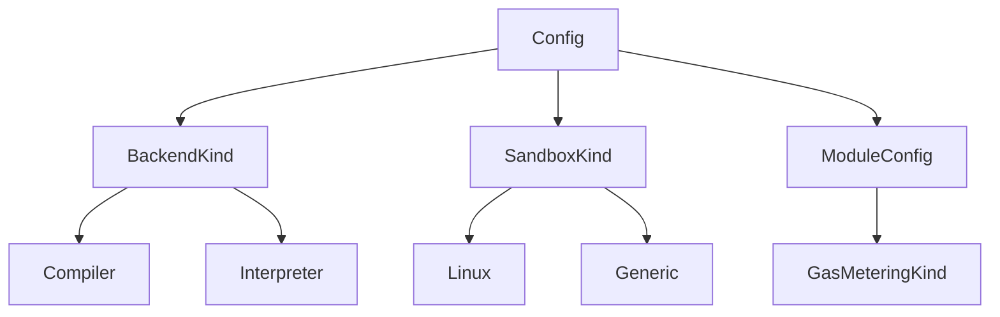
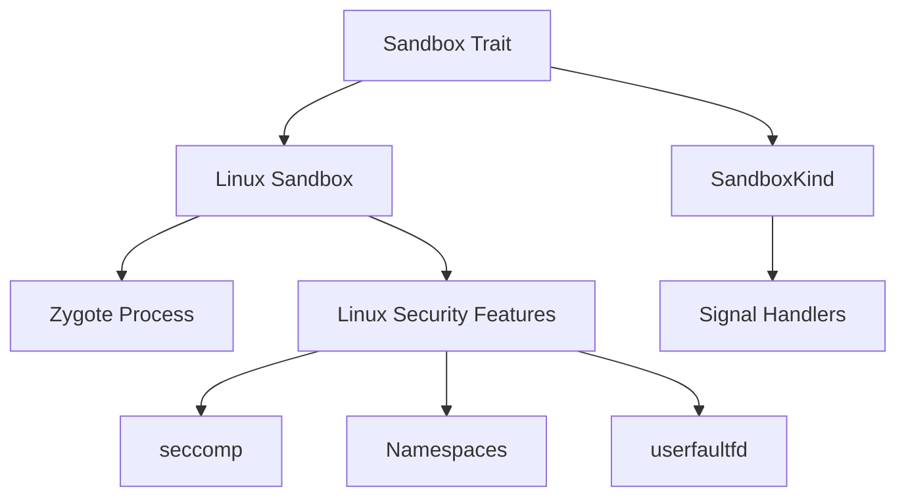
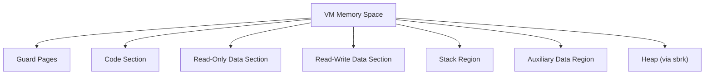
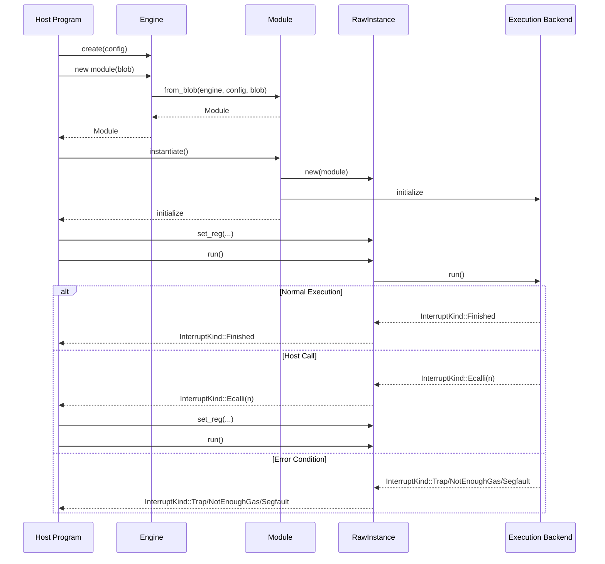

## Overview

PolkaVM is a high-performance, sandboxed virtual machine designed to securely execute RISC-V programs. It serves as a lightweight and efficient execution environment with a strong focus on security, determinism, and performance. This page provides a high-level introduction to the PolkaVM system, its architecture, and key components.

For detailed information about the execution engine internals, see [Core VM Engine](https://iurdao.github.io/technics/2025/05/24/Inside-PolkaVM-Unveiling-the-Core-VM-Engine.html). For information about the sandboxing mechanism, see [Sandboxing](https://iurdao.github.io/technics/2025/05/24/Sandboxing.html).

## Purpose and Goals

PolkaVM aims to provide a secure, deterministic, and efficient execution environment for untrusted code. Its primary design goals include:

1. **Security**: Isolate executing code using sandboxing techniques to prevent unauthorized system access
2. **Performance**: Offer high-speed execution through a JIT compiler backend when available
3. **Determinism**: Ensure consistent execution results regardless of the host environment
4. **Resource Control**: Limit resource consumption through gas metering
5. **Portability**: Run on various operating systems with platform-specific optimizations

Sources: [crates/polkavm/src/lib.rs1-171](https://github.com/paritytech/polkavm/blob/910adbda/crates/polkavm/src/lib.rs#L1-L171) [Cargo.toml1-202](https://github.com/paritytech/polkavm/blob/910adbda/Cargo.toml#L1-L202)

## System Architecture

PolkaVM's architecture consists of several key components that work together to provide a secure and efficient execution environment.

Sources: [crates/polkavm/src/lib.rs1-171](https://github.com/paritytech/polkavm/blob/910adbda/crates/polkavm/src/lib.rs#L1-L171) [Cargo.toml1-202](https://github.com/paritytech/polkavm/blob/910adbda/Cargo.toml#L1-L202) [crates/polkavm/src/config.rs1-534](https://github.com/paritytech/polkavm/blob/910adbda/crates/polkavm/src/config.rs#L1-L534)

### Core Components

#### Engine

The `Engine` is the central component of PolkaVM that manages the execution environment. It handles the creation of modules and provides configuration options for the VM.

Key features:

* Backend selection (Compiler or Interpreter)
* Sandbox configuration
* Worker management
* Caching behavior

Sources: [crates/polkavm/src/config.rs1-534](https://github.com/paritytech/polkavm/blob/910adbda/crates/polkavm/src/config.rs#L1-L534) [crates/polkavm/src/lib.rs139-148](https://github.com/paritytech/polkavm/blob/910adbda/crates/polkavm/src/lib.rs#L139-L148)

#### Module and Instance

The `Module` represents a compiled program ready for execution, while a `RawInstance` represents an active execution state.

* **Module**: Created from a `ProgramBlob`, contains the compiled code and metadata
* **RawInstance**: Created from a `Module`, maintains the execution state including registers, memory, and gas counter

The execution flow involves:

1. Creating a `Module` from a `ProgramBlob`
2. Instantiating a `RawInstance` from the `Module`
3. Running the instance, which produces an `InterruptKind` result

Sources: [crates/polkavm/src/lib.rs139-148](https://github.com/paritytech/polkavm/blob/910adbda/crates/polkavm/src/lib.rs#L139-L148) [crates/polkavm/src/utils.rs93-139](https://github.com/paritytech/polkavm/blob/910adbda/crates/polkavm/src/utils.rs#L93-L139)

#### Execution Backends

PolkaVM supports two execution backends:

1. **Compiler Backend**: JIT-compiles the program to native code for high performance
2. **Interpreter Backend**: Interprets the program's instructions directly, used as a fallback when compilation is not available

The appropriate backend is selected based on platform support and configuration.

Sources: [crates/polkavm/src/config.rs7-49](https://github.com/paritytech/polkavm/blob/910adbda/crates/polkavm/src/config.rs#L7-L49)

#### Sandboxing

The sandbox component provides isolation for executing untrusted code, preventing it from accessing the host system directly:

1. **Linux Sandbox**: Uses Linux-specific features like zygote processes, seccomp, and namespaces for efficient isolation
2. **Generic Sandbox**: A more portable implementation for other platforms

Sources: [crates/polkavm/src/config.rs51-98](https://github.com/paritytech/polkavm/blob/910adbda/crates/polkavm/src/config.rs#L51-L98) [.github/workflows/rust.yml1-133](https://github.com/paritytech/polkavm/blob/910adbda/.github/workflows/rust.yml#L1-L133)

#### Program Representation

Programs in PolkaVM are represented as a `ProgramBlob`, which contains:

* **Code**: The instructions to be executed
* **Read-Only Data**: Constant data used by the program
* **Read-Write Data**: Mutable data used by the program
* **Jump Table**: Information for optimizing jumps in the code

Sources: [crates/polkavm/src/lib.rs117-137](https://github.com/paritytech/polkavm/blob/910adbda/crates/polkavm/src/lib.rs#L117-L137)

#### Gas Metering

PolkaVM provides resource control through gas metering, allowing limits on how much computation a program can perform:

1. **Synchronous Gas Metering**: Checks gas consumption after every instruction
2. **Asynchronous Gas Metering**: Periodically checks gas consumption for better performance

Sources: [crates/polkavm/src/config.rs369-385](https://github.com/paritytech/polkavm/blob/910adbda/crates/polkavm/src/config.rs#L369-L385) [crates/polkavm/src/lib.rs139-146](https://github.com/paritytech/polkavm/blob/910adbda/crates/polkavm/src/lib.rs#L139-L146)

## Memory Management

PolkaVM manages memory for guest programs using a structured memory layout:

The system supports dynamic paging, allowing memory to be mapped on-demand when accessed, which can improve performance for certain workloads.

Sources: [crates/polkavm/src/utils.rs24-44](https://github.com/paritytech/polkavm/blob/910adbda/crates/polkavm/src/utils.rs#L24-L44) [crates/polkavm/src/config.rs426-447](https://github.com/paritytech/polkavm/blob/910adbda/crates/polkavm/src/config.rs#L426-L447)

## Execution Flow

The execution of a program in PolkaVM follows this general flow:

When a program executes, it may be interrupted for various reasons, represented by the `InterruptKind` enum:

* **Finished**: The program completed execution normally
* **Trap**: The program encountered an error or invalid operation
* **Ecalli**: The program is calling out to a host function
* **Segfault**: The program attempted an invalid memory access
* **NotEnoughGas**: The program ran out of its gas allocation
* **Step**: Returned when step tracing is enabled, after each instruction

Sources: [crates/polkavm/src/utils.rs93-139](https://github.com/paritytech/polkavm/blob/910adbda/crates/polkavm/src/utils.rs#L93-L139)

## Tools and Utilities

PolkaVM provides several tools for working with programs:

1. **polkatool**: Command-line utility for linking, assembling, disassembling and analyzing PolkaVM programs
2. **benchtool**: Benchmarking tool for comparing PolkaVM with other VMs
3. **spectool**: Test case generation and execution tool

Sources: [Cargo.toml1-202](https://github.com/paritytech/polkavm/blob/910adbda/Cargo.toml#L1-L202) [tools/benchtool/Cargo.lock1-5358](https://github.com/paritytech/polkavm/blob/910adbda/tools/benchtool/Cargo.lock#L1-L5358)

## Configuration Options

PolkaVM can be configured through a variety of options in the `Config` and `ModuleConfig` structs:

| Configuration      | Description                               | Default                        |
| ------------------ | ----------------------------------------- | ------------------------------ |
| Backend            | Execution backend (Compiler/Interpreter)  | Auto-detect                    |
| Sandbox            | Sandboxing mechanism (Linux/Generic)      | Auto-detect                    |
| Gas Metering       | Resource control method (Sync/Async/None) | None                           |
| Worker Count       | Number of worker sandboxes to keep alive  | 2                              |
| Dynamic Paging     | Enable on-demand memory mapping           | False                          |
| Cache Enabled      | Enable module caching                     | True with module-cache feature |
| Sandboxing Enabled | Enable security sandboxing                | True                           |
| Page Size          | Size of memory pages                      | 4096 (4KB)                     |
| Step Tracing       | Enable instruction-by-instruction tracing | False                          |

Sources: [crates/polkavm/src/config.rs100-367](https://github.com/paritytech/polkavm/blob/910adbda/crates/polkavm/src/config.rs#L100-L367) [crates/polkavm/src/config.rs392-534](https://github.com/paritytech/polkavm/blob/910adbda/crates/polkavm/src/config.rs#L392-L534)

## Platform Support

PolkaVM primarily targets the following platforms:

* **Linux** (x86\_64): Full support with the compiler backend and Linux-specific sandboxing
* **macOS** (x86\_64): Support with the generic sandbox when the feature is enabled
* **FreeBSD** (x86\_64): Support with the generic sandbox when the feature is enabled
* **Windows** (x86\_64): Limited support

The compiler backend is only available on x86\_64 architecture, while the interpreter backend works across all supported platforms.

Sources: [.github/workflows/rust.yml1-133](https://github.com/paritytech/polkavm/blob/910adbda/.github/workflows/rust.yml#L1-L133) [crates/polkavm/src/lib.rs9-51](https://github.com/paritytech/polkavm/blob/910adbda/crates/polkavm/src/lib.rs#L9-L51) [ci/jobs/check-freebsd.sh1-11](https://github.com/paritytech/polkavm/blob/910adbda/ci/jobs/check-freebsd.sh#L1-L11)

## System Requirements

For optimal performance with the Linux sandbox and dynamic paging:

* Linux 6.7+ kernel
* Unprivileged userfaultfd must be enabled (`/proc/sys/vm/unprivileged_userfaultfd` must be set to `1`)
* For some features, unprivileged user namespaces must be allowed

Sources: [crates/polkavm/src/config.rs299-308](https://github.com/paritytech/polkavm/blob/910adbda/crates/polkavm/src/config.rs#L299-L308) [.github/workflows/rust.yml1-133](https://github.com/paritytech/polkavm/blob/910adbda/.github/workflows/rust.yml#L1-L133)

