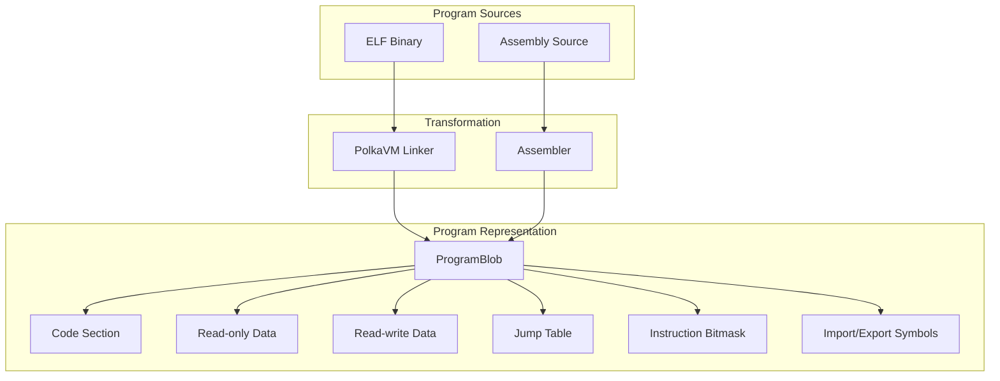
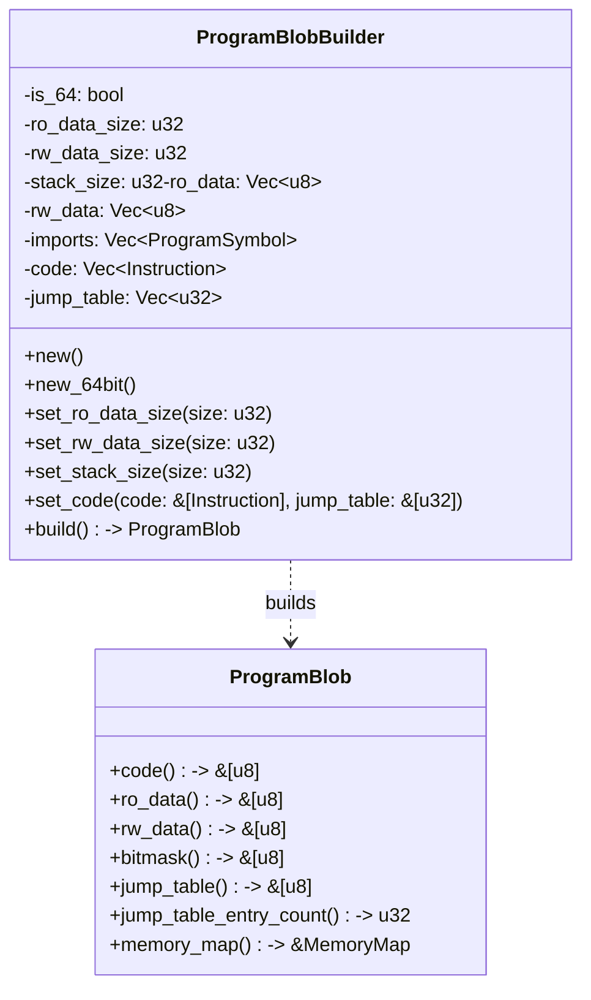
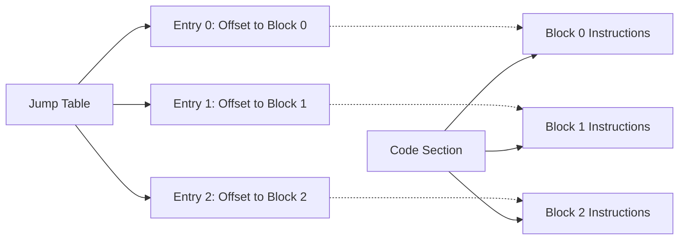
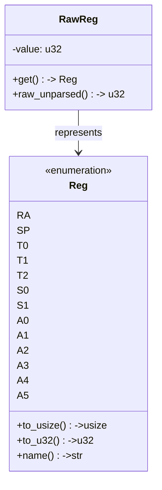
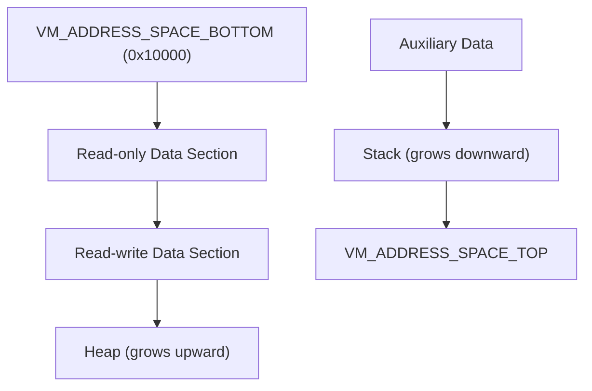
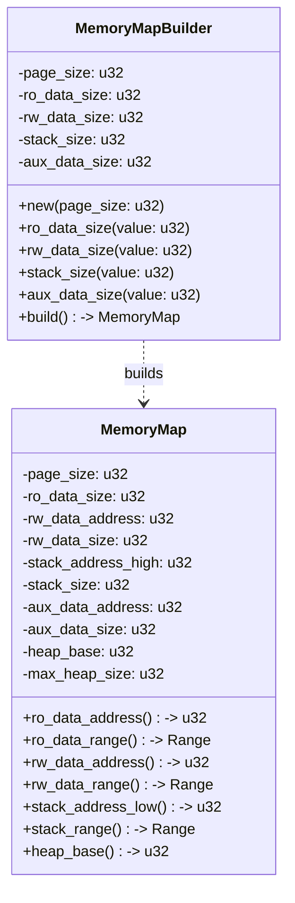
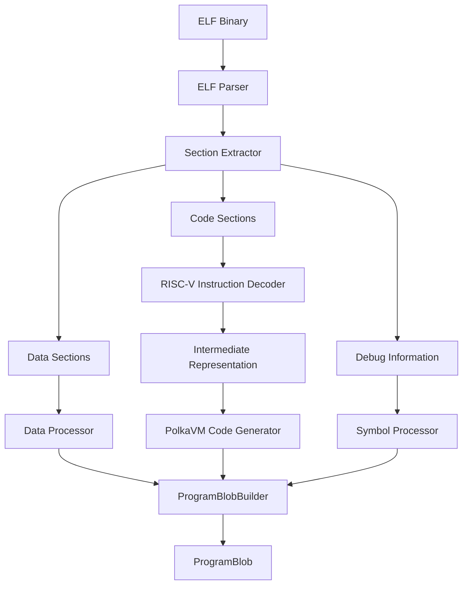
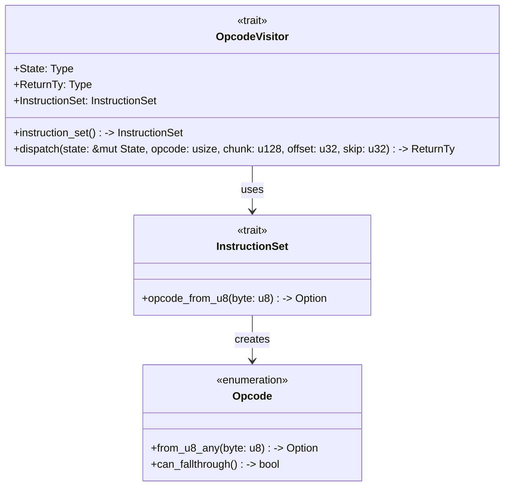
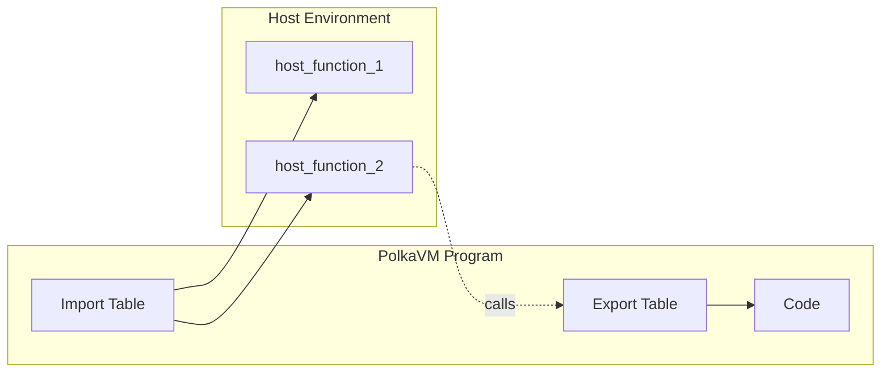
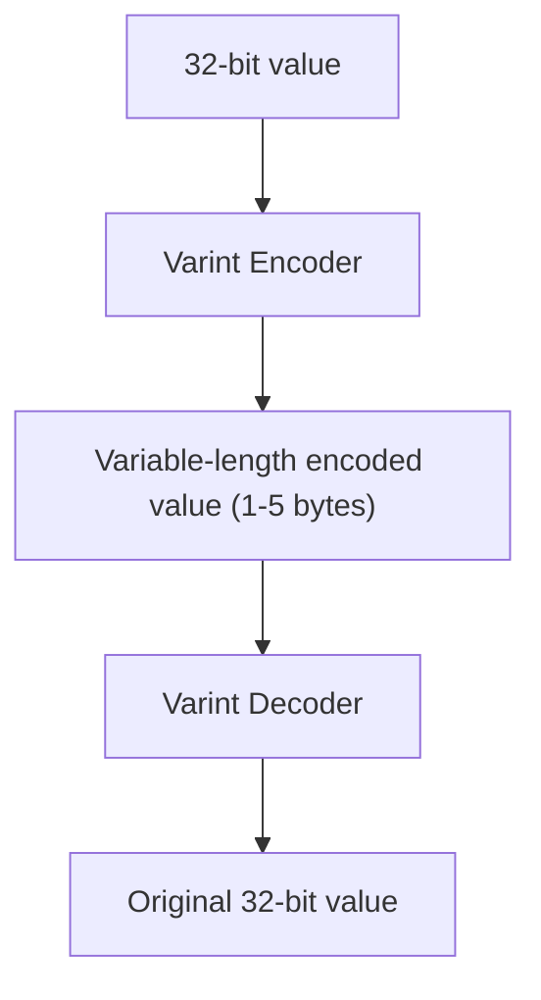

This article describes how executable programs are represented in PolkaVM, covering the structure, encoding, and transformation of programs. We focuse on the internal representation of compiled code, not the process of compilation itself here. For information about the compilation pipeline, see [Compilation Pipeline]().

## Overview

PolkaVM represents programs using a custom binary format called `ProgramBlob`. This format encapsulates all necessary components for program execution: code, data, jump tables, and symbols. Programs originate from either ELF binaries (compiled from languages like Rust) or from assembly source.




Sources:

* [crates/polkavm-linker/src/program\_from\_elf.rs](https://github.com/paritytech/polkavm/blob/910adbda/crates/polkavm-linker/src/program_from_elf.rs)
* [crates/polkavm-common/src/program.rs](https://github.com/paritytech/polkavm/blob/910adbda/crates/polkavm-common/src/program.rs)
* [crates/polkavm-common/src/writer.rs](https://github.com/paritytech/polkavm/blob/910adbda/crates/polkavm-common/src/writer.rs)

## ProgramBlob Format

The `ProgramBlob` is the core representation of a program in PolkaVM. It's a binary format that contains all the information needed to execute a program.

### Key Components

| Component             | Description                                                 |
| --------------------- | ----------------------------------------------------------- |
| Magic+Version Header  | Identifies the blob as a PolkaVM program and its version    |
| Memory Config         | Defines memory layout parameters (page size, section sizes) |
| Code Section          | Contains the executable instructions                        |
| Read-only Data        | Constant data that doesn't change during execution          |
| Read-write Data       | Data that can be modified during program execution          |
| Jump Table            | Maps basic block indices to instruction offsets             |
| Bitmask               | Bitfield that marks instruction boundaries                  |
| Import/Export Symbols | Symbols for interfacing with external code                  |

### Program Header Structure

The blob starts with a header that contains:

* Magic identifier "PVM\0" (4 bytes)
* Size of the entire blob (variable-length encoding)
* Memory configuration data

### Building ProgramBlobs

The `ProgramBlobBuilder` class handles the construction of program blobs, managing the serialization of all components into the final binary format.




Sources:

* [crates/polkavm-common/src/writer.rs84-168](https://github.com/paritytech/polkavm/blob/910adbda/crates/polkavm-common/src/writer.rs#L84-L168)
* [crates/polkavm-common/src/writer.rs157-340](https://github.com/paritytech/polkavm/blob/910adbda/crates/polkavm-common/src/writer.rs#L157-L340)

## Code Representation

### Instruction Encoding

PolkaVM uses a variable-length instruction encoding scheme. Each instruction starts with an opcode byte, followed by variable-length operands. This compact representation balances code density with execution efficiency.

Key characteristics:

* Variable-length instructions (1 to 17 bytes)
* First byte is always the opcode
* Operands use variable-length encoding for integers
* Register operands are encoded efficiently
* Relative jumps use offset-based encoding

### Instruction Bitmask

To efficiently identify instruction boundaries without full decoding, PolkaVM uses a bitmask:

* A bit is set (1) for the first byte of each instruction
* Continuation bytes are marked with 0
* Allows quick jumping to instruction boundaries

```
Code:    [Instr1][Instr2  ][Instr3][Instr4    ]
Bitmask: 1      1         1      1            
         ^      ^         ^      ^
         |      |         |      |
         Start  Start     Start  Start

```

### Jump Table

The jump table maps basic block indices to their positions in the code section:

* Enables efficient control flow transfers (jumps, branches)
* Abstracts away the actual instruction offsets
* Contains entries of variable size depending on offset magnitude




Sources:

* [crates/polkavm-common/src/program.rs187-349](https://github.com/paritytech/polkavm/blob/910adbda/crates/polkavm-common/src/program.rs#L187-L349)
* [crates/polkavm-common/src/program.rs351-445](https://github.com/paritytech/polkavm/blob/910adbda/crates/polkavm-common/src/program.rs#L351-L445)
* [crates/polkavm-common/src/writer.rs293-320](https://github.com/paritytech/polkavm/blob/910adbda/crates/polkavm-common/src/writer.rs#L293-L320)

## Register Representation

PolkaVM uses a fixed set of registers that map to RISC-V registers. These are encoded efficiently in instructions.

### Register Set

| PolkaVM Register | RISC-V ABI Name | Description               |
| ---------------- | --------------- | ------------------------- |
| `RA`             | ra              | Return address            |
| `SP`             | sp              | Stack pointer             |
| `T0`-`T2`        | t0-t2           | Temporary registers       |
| `S0`-`S1`        | s0-s1           | Saved registers           |
| `A0`-`A5`        | a0-a5           | Argument/return registers |




Sources:

* [crates/polkavm-common/src/program.rs8-169](https://github.com/paritytech/polkavm/blob/910adbda/crates/polkavm-common/src/program.rs#L8-L169)
* [crates/polkavm-linker/src/program\_from\_elf.rs22-152](https://github.com/paritytech/polkavm/blob/910adbda/crates/polkavm-linker/src/program_from_elf.rs#L22-L152)

## Memory Layout

The memory layout for PolkaVM programs follows a specific structure to ensure proper isolation and efficient access.




### Memory Sections

| Section         | Description                      | Access                 |
| --------------- | -------------------------------- | ---------------------- |
| Read-only Data  | Constants, string literals, etc. | Read-only              |
| Read-write Data | Global variables, mutable data   | Read-write             |
| Stack           | Local variables, call frames     | Read-write             |
| Heap            | Dynamically allocated memory     | Read-write             |
| Auxiliary Data  | Implementation-specific data     | Implementation-defined |

### Memory Map Builder

The `MemoryMapBuilder` class handles the calculation of memory layout based on program requirements:

* Ensures proper alignment of sections
* Handles page size requirements
* Calculates maximum heap size based on available address space




Sources:

* [crates/polkavm-common/src/abi.rs1-333](https://github.com/paritytech/polkavm/blob/910adbda/crates/polkavm-common/src/abi.rs#L1-L333)
* [crates/polkavm-common/src/abi.rs41-172](https://github.com/paritytech/polkavm/blob/910adbda/crates/polkavm-common/src/abi.rs#L41-L172)
* [crates/polkavm-common/src/abi.rs176-283](https://github.com/paritytech/polkavm/blob/910adbda/crates/polkavm-common/src/abi.rs#L176-L283)

## Program Transformation Process

The process of transforming source programs (ELF binaries or assembly) into the PolkaVM representation involves several steps.

### ELF to ProgramBlob Conversion




1. Parse the ELF file to extract sections and symbols
2. Process code sections by converting RISC-V instructions to PolkaVM instructions
3. Handle relocations and symbol references
4. Place data sections in appropriate locations
5. Generate the jump table and bitmask
6. Construct the final ProgramBlob

### Assembly to ProgramBlob Conversion

Assembly is parsed directly into PolkaVM instructions, which are then assembled into a ProgramBlob. This provides a more direct route for creating PolkaVM programs.

Sources:

* [crates/polkavm-linker/src/program\_from\_elf.rs](https://github.com/paritytech/polkavm/blob/910adbda/crates/polkavm-linker/src/program_from_elf.rs)
* [crates/polkavm-linker/src/elf.rs](https://github.com/paritytech/polkavm/blob/910adbda/crates/polkavm-linker/src/elf.rs)
* [crates/polkavm-common/src/writer.rs](https://github.com/paritytech/polkavm/blob/910adbda/crates/polkavm-common/src/writer.rs)

## Instruction Visitor Pattern

PolkaVM uses the Visitor pattern to process instructions. The `OpcodeVisitor` trait defines an interface for traversing and operating on instructions:



This pattern enables:

* Efficient instruction traversal
* Different operations (execution, disassembly, analysis) sharing the same traversal mechanism
* Separation of instruction decoding from operation

Sources:

* [crates/polkavm-common/src/program.rs742-840](https://github.com/paritytech/polkavm/blob/910adbda/crates/polkavm-common/src/program.rs#L742-L840)
* [crates/polkavm-common/src/program.rs326-349](https://github.com/paritytech/polkavm/blob/910adbda/crates/polkavm-common/src/program.rs#L326-L349)

## Symbol Handling

PolkaVM programs can import and export symbols for interaction with host functions and to expose functionality.

### Import Symbols

Imports represent external functions that the program can call:

* Each import has a unique name
* Host environments provide implementations for these functions
* Calls to imports are handled via special `ecalli` instructions

### Export Symbols

Exports are functions within the program that can be called from outside:

* Each export has a name and a target (basic block index)
* The main entry point of a program is typically an export
* External code can invoke exports by name




Sources:

* [crates/polkavm-common/src/writer.rs138-149](https://github.com/paritytech/polkavm/blob/910adbda/crates/polkavm-common/src/writer.rs#L138-L149)
* [crates/polkavm-linker/src/program\_from\_elf.rs](https://github.com/paritytech/polkavm/blob/910adbda/crates/polkavm-linker/src/program_from_elf.rs)

## Variable-Length Integer Encoding

PolkaVM uses variable-length encoding for integer values to save space in instructions. Two main encoding schemes are used:

### Varint Encoding

Used for general-purpose variable-length integers:

* Small values use fewer bytes
* First byte contains size information and part of the value
* Can encode 32-bit values in 1-5 bytes

### Simple Varint Encoding

Used for instruction operands:

* Optimized for the common case of small values
* Number of bytes determined by the instruction's "skip" value
* Efficiently handles sign extension




Sources:

* [crates/polkavm-common/src/varint.rs1-215](https://github.com/paritytech/polkavm/blob/910adbda/crates/polkavm-common/src/varint.rs#L1-L215)
* [crates/polkavm-common/src/program.rs446-521](https://github.com/paritytech/polkavm/blob/910adbda/crates/polkavm-common/src/program.rs#L446-L521)

## Conclusion

The program representation in PolkaVM is designed to efficiently store and execute programs. The `ProgramBlob` format encapsulates all necessary components (code, data, jump table, etc.) in a compact binary representation. The variable-length instruction encoding and efficient memory layout ensure that programs can be executed with minimal overhead.

This representation is a core part of the PolkaVM system, bridging the gap between source programs (ELF binaries or assembly) and the execution engine. Understanding this representation is essential for working with the PolkaVM ecosystem.
