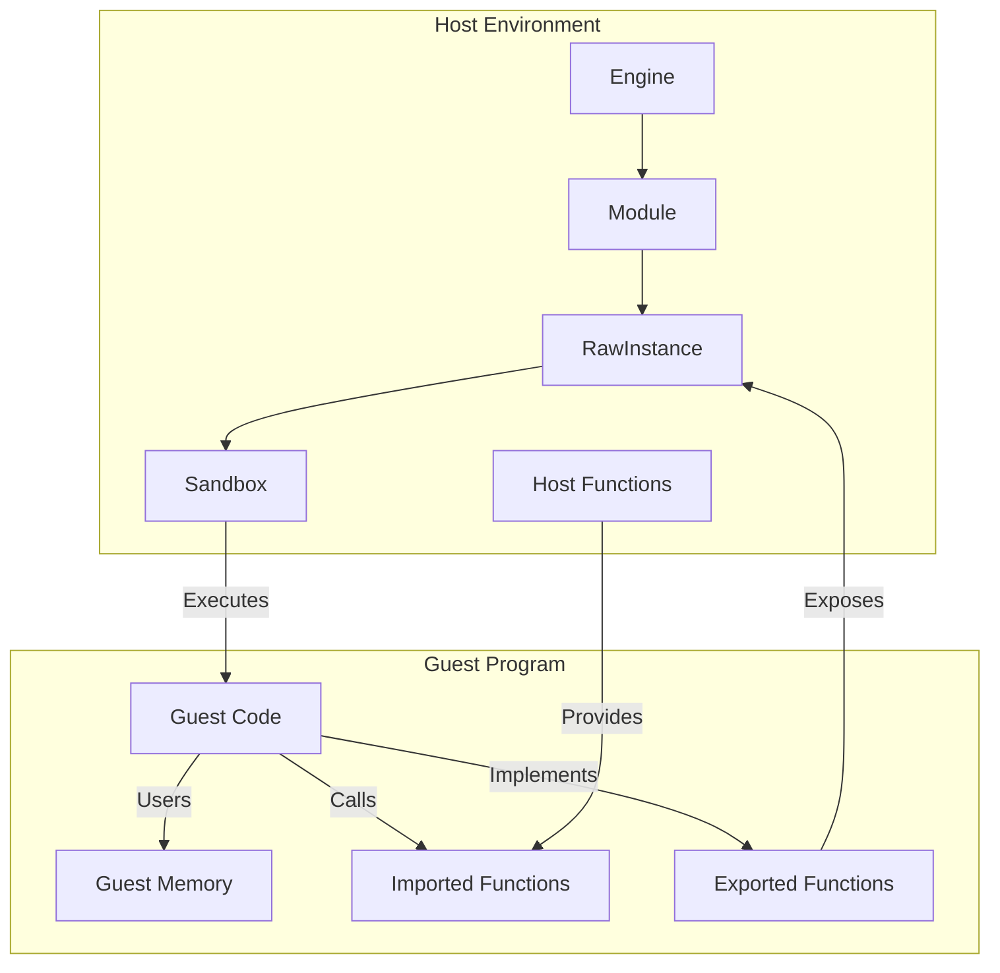
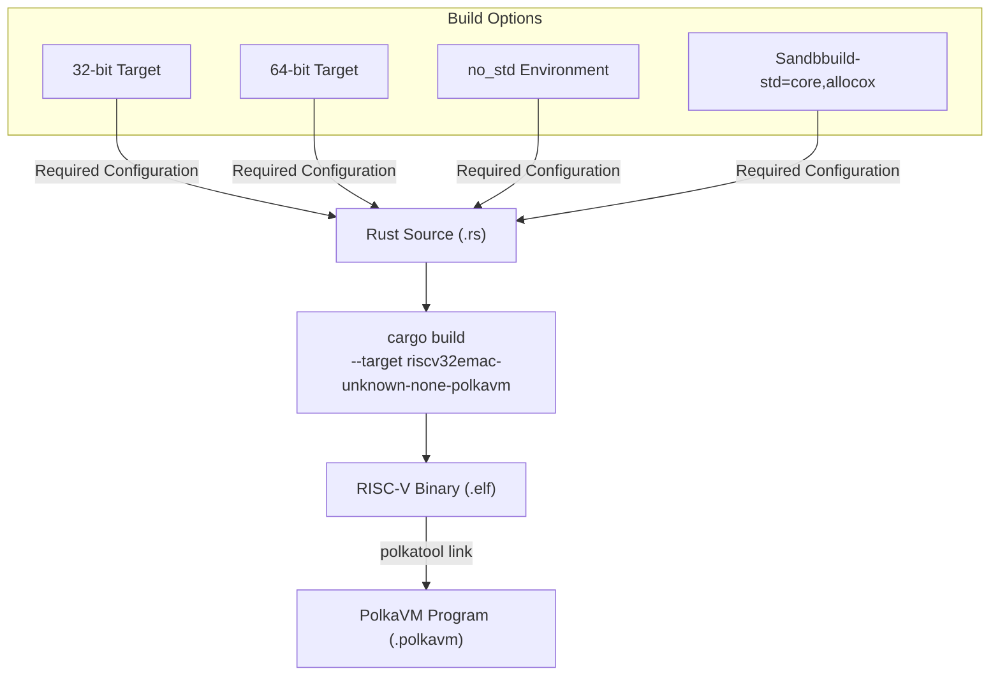
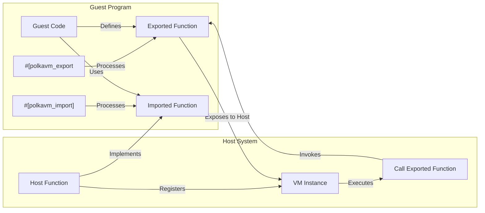

This document explains how to develop programs that run inside the PolkaVM virtual machine. It covers the development environment, build process, and the Application Binary Interface (ABI) that allows guest programs to interact with the host system. For details on how the VM executes these programs, see [Core VM Engine](https://iurdao.github.io/technics/2025/05/24/Inside-PolkaVM-Unveiling-the-Core-VM-Engine.html) and for in-depth details on exports and imports, see [ABI and Exports/Imports]().

## Overview of Guest Programs

Guest programs in PolkaVM are applications that run within the sandboxed virtual machine environment. These programs are written in languages like Rust that can compile to RISC-V architecture, and are then transformed into a format that PolkaVM can execute.

The key characteristics of PolkaVM guest programs include:

1. **RISC-V Based**: Guest programs target the RISC-V architecture, specifically using custom target configurations provided by PolkaVM.
2. **No Standard Library**: Programs run in a `no_std` environment as they don't have access to an operating system.
3. **Import/Export System**: Communication with the host happens through a well-defined function import/export system.
4. **Memory Constraints**: Programs operate within a confined memory space with specialized allocation mechanisms.




Sources: [crates/polkavm-derive-impl/src/export.rs](https://github.com/paritytech/polkavm/blob/910adbda/crates/polkavm-derive-impl/src/export.rs) [crates/polkavm-derive-impl/src/import.rs](https://github.com/paritytech/polkavm/blob/910adbda/crates/polkavm-derive-impl/src/import.rs)

## Development Environment Setup

To develop guest programs for PolkaVM, you need to set up a development environment that can compile for the RISC-V architecture. The system uses custom target configurations for RISC-V with specific extensions enabled.

### Required Components

1. **Rust Toolchain**: A recent version of Rust with support for custom targets
2. **RISC-V Target**: The `riscv32emac-unknown-none-polkavm` target (for 32-bit programs) or `riscv64emac-unknown-none-polkavm` target (for 64-bit programs)
3. **Build Tools**: The `polkatool` utility for linking and processing the compiled binaries

The cargo configuration for guest programs is typically set to use the 32-bit RISC-V target by default:

```rust
[build]
target = "../crates/polkavm-linker/riscv32emac-unknown-none-polkavm.json"

[unstable]
build-std = ["core", "alloc"]

```

Sources: [guest-programs/.cargo/config.toml](https://github.com/paritytech/polkavm/blob/910adbda/guest-programs/.cargo/config.toml) [guest-programs/build-benchmarks.sh66-94](https://github.com/paritytech/polkavm/blob/910adbda/guest-programs/build-benchmarks.sh#L66-L94)

## Building Guest Programs

Building guest programs for PolkaVM involves a multi-step process:

1. Compile the Rust code to a RISC-V binary
2. Use `polkatool` to link and convert the binary to PolkaVM's program blob format

The repository includes helper scripts like `build-examples.sh` and `build-benchmarks.sh` that automate this process.




### Example Build Command Sequence

For a typical guest program, the build process looks like this:

```rust
# Compile to RISC-V binary
cargo build -Z build-std=core,alloc --target riscv32emac-unknown-none-polkavm --release --bin my-program

# Link and convert to PolkaVM format
polkatool link path/to/my-program -o my-program.polkavm

```

Sources: [guest-programs/build-examples.sh12-30](https://github.com/paritytech/polkavm/blob/910adbda/guest-programs/build-examples.sh#L12-L30) [guest-programs/build-benchmarks.sh96-133](https://github.com/paritytech/polkavm/blob/910adbda/guest-programs/build-benchmarks.sh#L96-L133)

## Application Binary Interface (ABI)

PolkaVM uses a well-defined Application Binary Interface (ABI) for communication between the guest program and the host. This ABI consists of:

1. **Exports**: Functions implemented in the guest program that can be called by the host
2. **Imports**: Host functions that can be called by the guest program

The ABI is implemented using Rust procedural macros provided by the `polkavm-derive` crate.




### Exporting Functions to the Host

To make a function in your guest program callable from the host, use the `#[polkavm_export]` attribute macro:

```rust
#[polkavm_export]
fn add(a: u32, b: u32) -> u32 {
    a + b
}
```

Behind the scenes, this macro generates:

1. A trampoline function that handles the ABI conversion
2. Metadata about the exported function (name, arguments, return type)
3. Special ELF sections that the PolkaVM linker uses to identify exports

The export system supports up to 6 function arguments due to the RISC-V register usage convention implemented in the ABI.

Sources: [crates/polkavm-derive-impl/src/export.rs75-229](https://github.com/paritytech/polkavm/blob/910adbda/crates/polkavm-derive-impl/src/export.rs#L75-L229)

### Importing Host Functions

To call functions implemented by the host from your guest program, use the `#[polkavm_import]` attribute with an `extern "C"` block:

```rust
#[polkavm_import]
extern "C" {
    fn host_log(message: &str);     
    #[polkavm_import(index = 1)]
    fn host_get_timestamp() -> u64; 
}
```

Each imported function can have an optional numeric index for efficient resolution, or it will use the function name as a string symbol by default.

Sources: [crates/polkavm-derive-impl/src/import.rs160-386](https://github.com/paritytech/polkavm/blob/910adbda/crates/polkavm-derive-impl/src/import.rs#L160-L386) [crates/polkavm-derive-impl/src/abi\_support\_impl/common\_private.rs164-351](https://github.com/paritytech/polkavm/blob/910adbda/crates/polkavm-derive-impl/src/abi_support_impl/common_private.rs#L164-L351)

## Memory Management

PolkaVM guest programs operate within a confined memory space. The VM provides special primitives for memory management:

1. **`sbrk`**: A function to expand the program's heap
2. **`LeakingAllocator`**: A basic memory allocator that doesn't support deallocation
3. **`memset`**: A hardware-accelerated memory set function
4. **`min_stack_size`**: A macro to set the minimum stack size for the program

Example usage of these memory management primitives:

```rust
// Increase heap size by 1024 bytes 
let new_heap_end = polkavm_derive::sbrk(1024); 
if new_heap_end.is_null() {
// Handle allocation failure
}

// Define a global allocator
#[global_allocator]
static ALLOCATOR: polkavm_derive::LeakingAllocator = polkavm_derive::LeakingAllocator; 
// Set minimum stack size
polkavm_derive::min_stack_size!(8192);
```

Sources: [crates/polkavm-derive/src/lib.rs12-107](https://github.com/paritytech/polkavm/blob/910adbda/crates/polkavm-derive/src/lib.rs#L12-L107)

## Creating a Basic Guest Program

Here's the basic structure of a minimal PolkaVM guest program:

```rust
#![no_std]
#![no_main] 
use polkavm_derive::{polkavm_export, polkavm_import}; 
// Define host functions that the guest can call
#[polkavm_import]
extern "C" {
    fn host_print(message: &str); 
}

// Export a function to be called by the host
#[polkavm_export]
fn hello_world() {
    unsafe {
        host_print("Hello from PolkaVM!");
    } 
}

// Required for panic handling in no_std environment
#[panic_handler]
fn panic(_info: &core::panic::PanicInfo) -> ! {
    loop {}
}
```

The program must be compiled with:

* The `no_std` attribute because it runs without an operating system
* The `no_main` attribute because the entry point is defined by the host calling an exported function

When building such a program, the scripts from the repository will automatically handle the proper compilation steps and linking.

Sources: [guest-programs/test-blob/src/main.rs1-4](https://github.com/paritytech/polkavm/blob/910adbda/guest-programs/test-blob/src/main.rs#L1-L4) [guest-programs/build-examples.sh32](https://github.com/paritytech/polkavm/blob/910adbda/guest-programs/build-examples.sh#L32-L32)

## Benchmark Programs

PolkaVM includes a set of benchmark programs used to evaluate the performance of the VM:

* `bench-minimal`: A minimal program for basic overhead testing
* `bench-pinky`: A more complex example with various features
* `bench-prime-sieve`: A CPU-intensive prime number calculation
* `bench-memset`: Memory operations benchmark

These benchmarks can be built for multiple targets to compare performance:

| Target           | Description                           |
| ---------------- | ------------------------------------- |
| polkavm (32-bit) | Default target for PolkaVM            |
| polkavm (64-bit) | 64-bit version of PolkaVM target      |
| wasm32           | WebAssembly target for comparison     |
| native x86\_64   | Native Linux x86\_64 compilation      |
| native i686      | Native Linux x86 (32-bit) compilation |
| CKB VM           | Another RISC-V based VM               |
| Solana eBPF      | Solana's BPF virtual machine          |

Sources: [guest-programs/build-benchmarks.sh135-139](https://github.com/paritytech/polkavm/blob/910adbda/guest-programs/build-benchmarks.sh#L135-L139) [guest-programs/build-benchmarks.sh9-61](https://github.com/paritytech/polkavm/blob/910adbda/guest-programs/build-benchmarks.sh#L9-L61)

## Conclusion

PolkaVM guest programs are RISC-V-based applications that run within the PolkaVM sandboxed environment. They use a specialized ABI system to communicate with the host, with exports (functions accessible to the host) and imports (host functions accessible to the guest). Guest programs have constrained memory management and operate in a `no_std` environment.

Development requires Rust with the RISC-V target configuration, and the build process involves compiling to RISC-V and then using `polkatool` to convert to the PolkaVM format. The PolkaVM repository provides various examples and benchmarks that demonstrate how to write effective guest programs.

For more details on specific ABI features and advanced usage patterns, see [ABI and Exports/Imports]() and [Building Guest Programs]().
