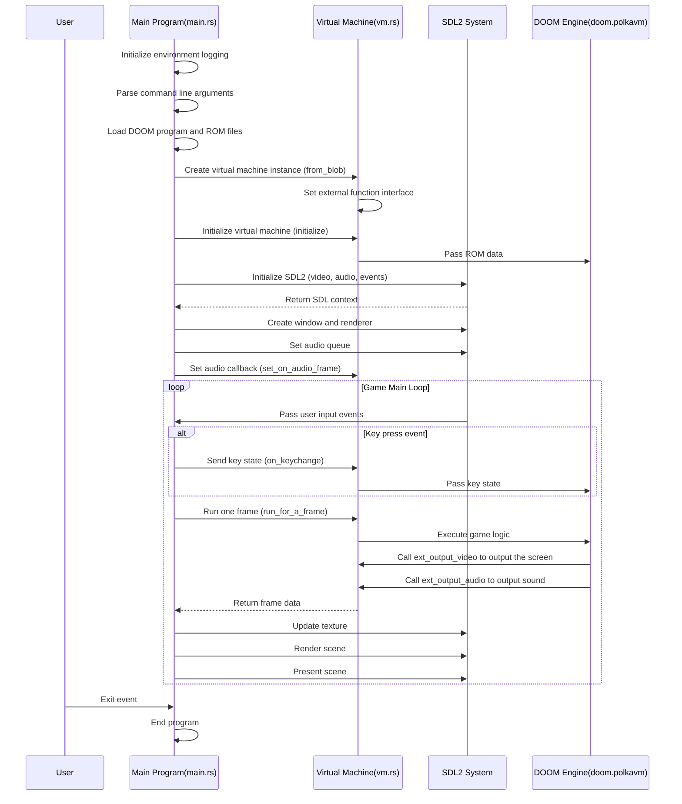

## Project Overview

PolkaVM DOOM is an example project that ports the classic game DOOM to run on the PolkaVM virtual machine. This project showcases PolkaVM's ability to run complex game programs.

## Directory Structure

```

/examples/doom/
├── Cargo.toml          # Project configuration and dependencies
├── README.md           # Project documentation
├── roms/               # Game ROM files directory
│   ├── README.md       # ROM file description
│   ├── doom-wad-shareware-license.txt  # DOOM WAD file license
│   ├── doom.polkavm    # PolkaVM binary of the DOOM engine
│   ├── doom1.wad       # DOOM game data file
│   └── relink.sh       # Script to relink the DOOM program
└── src/                # Source code directory
    ├── keys.rs         # Key mappings and handling
    ├── main.rs         # Main program entry point
    └── vm.rs           # Virtual machine implementation

```


## Core Component Analysis
### 1. Project Configuration (Cargo.toml)

The project depends on:

*   `polkavm`: PolkaVM virtual machine core library
*   `sdl2`: Used for graphics display and input handling
*   `env_logger`: For logging

### 2. ROM Files

*   `doom1.wad`: DOOM game's shareware WAD file, containing game data
*   `doom.polkavm`: DOOM engine binary compiled for PolkaVM format
*   `relink.sh`: Script used to relink from ELF file to generate PolkaVM binary

### 3. Source Code Structure

*   **main.rs (Main Program)**
    Main functions:
    *   Initializes SDL2 environment (video, audio, event handling)
    *   Loads DOOM program and ROM files
    *   Creates the game window and rendering context
    *   Handles user input (keyboard and mouse events)
    *   Implements the main game loop (rendering frames, handling audio)

*   **vm.rs (Virtual Machine Implementation)**
    Main functions:
    *   Defines the `Vm` struct, encapsulating the PolkaVM instance
    *   Implements the interaction interface with the DOOM program
    *   Provides external functions for the DOOM program to call:
        *   `ext_output_video`: Handles video output
        *   `ext_output_audio`: Handles audio output
        *   `ext_rom_size` and `ext_rom_read`: Provides ROM access
        *   `ext_stdout`: Standard output redirection
    *   Manages game state and resources

*   **keys.rs (Key Handling)**
    Main functions:
    *   Defines the key constants used by DOOM
    *   Provides mapping functions from SDL2 keys to DOOM keys

## Execution Flow

1.  The program loads the DOOM engine (`doom.polkavm`) and game data (`doom1.wad`) upon startup.
2.  It initializes the SDL2 environment and PolkaVM virtual machine.
3.  A game window and audio queue are created.
4.  The program enters the main loop:
    *   Processes user input events
    *   Runs the virtual machine to execute a frame of game logic
    *   Renders the game scene
    *   Handles audio output



## Special Notes

1.  The project supports different operating systems, but it will use interpreter mode on non-Linux/macOS systems, which is slower.
2.  The DOOM engine source code is hosted in a separate repository: <https://github.com/koute/polkadoom>
3.  The PolkaVM binary file can be regenerated from the ELF file via the `relink.sh` script.

This project is a good demonstration of PolkaVM's capabilities, proving that it can run complex game programs while providing good cross-platform compatibility.