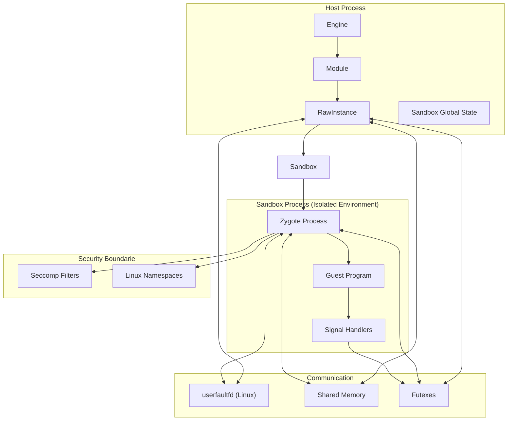
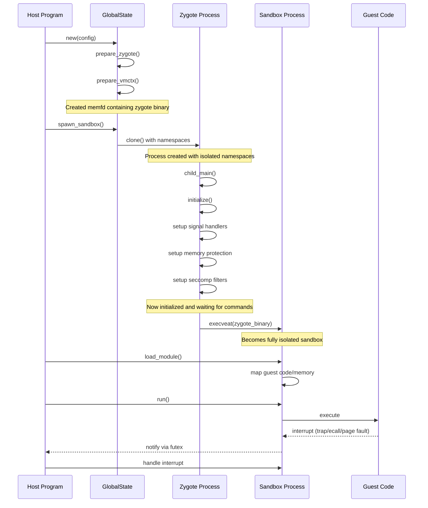
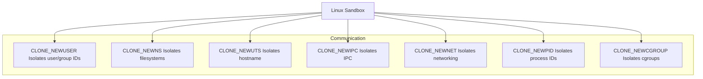
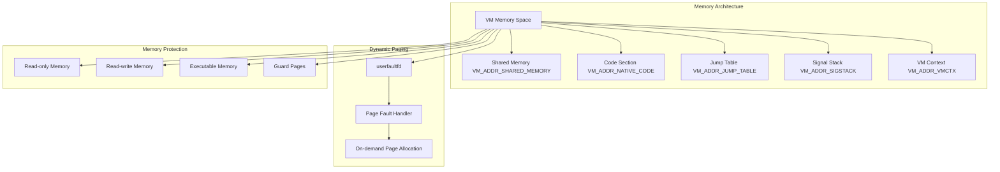
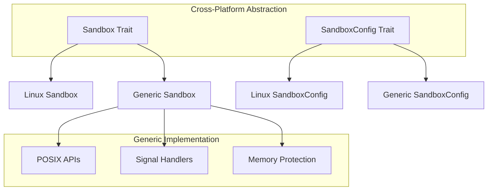
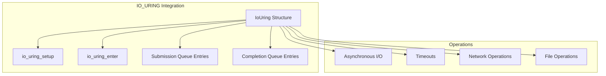
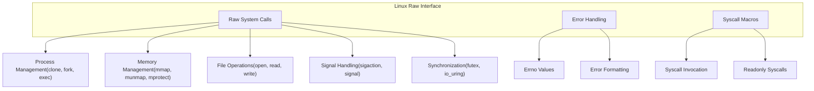

This article describes how PolkaVM integrates with host operating systems, focusing on sandboxing, isolation mechanisms, and system call interfaces. It covers the architecture of the sandboxing system, the communication between the host and sandbox processes, and platform-specific implementations.

For information about how to execute guest programs within PolkaVM, see [Execution Flow]().

## Host and Sandbox Process Architecture

PolkaVM uses a multi-process architecture to provide strong isolation between guest code and the host system. This approach provides stronger security guarantees than in-process isolation techniques.

Sources:

* [crates/polkavm/src/sandbox/linux.rs36-41](https://github.com/paritytech/polkavm/blob/910adbda/crates/polkavm/src/sandbox/linux.rs#L36-L41)
* [crates/polkavm/src/sandbox/linux.rs96-180](https://github.com/paritytech/polkavm/blob/910adbda/crates/polkavm/src/sandbox/linux.rs#L96-L180)
* [crates/polkavm-zygote/src/main.rs274-278](https://github.com/paritytech/polkavm/blob/910adbda/crates/polkavm-zygote/src/main.rs#L274-L278)

## Linux-specific Implementation

PolkaVM provides a specialized Linux sandbox implementation that leverages various Linux-specific features to provide strong isolation and security guarantees.

### Zygote Process

The zygote process is a pre-initialized template process that is forked to create new sandbox instances quickly. This approach is similar to what Android uses for launching applications.

Sources:

* [crates/polkavm/src/sandbox/linux.rs456-458](https://github.com/paritytech/polkavm/blob/910adbda/crates/polkavm/src/sandbox/linux.rs#L456-L458)
* [crates/polkavm/src/sandbox/linux.rs644-672](https://github.com/paritytech/polkavm/blob/910adbda/crates/polkavm/src/sandbox/linux.rs#L644-L672)
* [crates/polkavm-zygote/src/main.rs274-278](https://github.com/paritytech/polkavm/blob/910adbda/crates/polkavm-zygote/src/main.rs#L274-L278)

### Sandbox Creation Process

The Linux sandbox implementation uses a multi-step process to create a secure, isolated environment:

1. **Prepare Zygote**: The host creates a memory file descriptor (memfd) containing the zygote binary
2. **Clone Process**: A new process is created with isolated namespaces
3. **Initialize Child**: The child process initializes its environment:
   * Sets up signal handlers
   * Maps shared memory regions
   * Prepares memory protection
   * Configures seccomp filters
4. **Execute Zygote**: The child process executes the zygote binary
5. **Load Module**: The host loads a module into the sandbox
6. **Execute Code**: The sandbox executes the guest code

Sources:

* [crates/polkavm/src/sandbox/linux.rs739-895](https://github.com/paritytech/polkavm/blob/910adbda/crates/polkavm/src/sandbox/linux.rs#L739-L895)
* [crates/polkavm-zygote/src/main.rs450-710](https://github.com/paritytech/polkavm/blob/910adbda/crates/polkavm-zygote/src/main.rs#L450-L710)

### Linux Security Mechanisms

PolkaVM leverages several Linux-specific security mechanisms:

#### Namespaces Isolation

Sources:

* [crates/polkavm/src/sandbox/linux.rs47-53](https://github.com/paritytech/polkavm/blob/910adbda/crates/polkavm/src/sandbox/linux.rs#L47-L53)
* [crates/polkavm/src/sandbox/linux.rs151-171](https://github.com/paritytech/polkavm/blob/910adbda/crates/polkavm/src/sandbox/linux.rs#L151-L171)

#### Resource Limits

The sandbox implements tight resource limits:

| Resource         | Limit | Purpose                     |
| ---------------- | ----- | --------------------------- |
| RLIMIT\_DATA     | 8 GB  | Maximum data segment size   |
| RLIMIT\_STACK    | 16 KB | Maximum stack size          |
| RLIMIT\_NPROC    | 1     | Prevent process creation    |
| RLIMIT\_FSIZE    | 0     | Prevent file creation       |
| RLIMIT\_LOCKS    | 0     | Prevent file locks          |
| RLIMIT\_MEMLOCK  | 0     | Prevent memory locking      |
| RLIMIT\_MSGQUEUE | 0     | Prevent message queue usage |

Sources:

* [crates/polkavm/src/sandbox/linux.rs857-878](https://github.com/paritytech/polkavm/blob/910adbda/crates/polkavm/src/sandbox/linux.rs#L857-L878)

#### Seccomp Filtering

The sandbox uses Linux's secure computing (seccomp) mode to restrict which system calls can be executed by the sandboxed process, providing an additional layer of security.

Sources:

* [crates/polkavm-zygote/src/main.rs1090-1120](https://github.com/paritytech/polkavm/blob/910adbda/crates/polkavm-zygote/src/main.rs#L1090-L1120)

### Memory Management

Memory management is a critical aspect of system integration in PolkaVM:

Sources:

* [crates/polkavm-common/src/zygote.rs86-137](https://github.com/paritytech/polkavm/blob/910adbda/crates/polkavm-common/src/zygote.rs#L86-L137)
* [crates/polkavm/src/sandbox/linux.rs97-127](https://github.com/paritytech/polkavm/blob/910adbda/crates/polkavm/src/sandbox/linux.rs#L97-L127)
* [crates/polkavm-zygote/src/main.rs542-592](https://github.com/paritytech/polkavm/blob/910adbda/crates/polkavm-zygote/src/main.rs#L542-L592)

### Communication Channels

PolkaVM uses several mechanisms for communication between the host and sandbox processes:

1. **Shared Memory**: Used to transfer data and state between processes
2. **Futexes**: Used for synchronization and notification
3. **userfaultfd**: Used for dynamic paging and memory management
4. **File Descriptors**: Used for various I/O operations

Futexes (Fast User-space Mutexes) are particularly important for signaling between the host and sandbox:

| Futex State                           | Meaning                               |
| ------------------------------------- | ------------------------------------- |
| VMCTX\_FUTEX\_IDLE                    | Sandbox is idle, waiting for commands |
| VMCTX\_FUTEX\_BUSY                    | Sandbox is busy executing code        |
| VMCTX\_FUTEX\_GUEST\_TRAP             | Guest code triggered a trap           |
| VMCTX\_FUTEX\_GUEST\_ECALLI           | Guest code made a host call           |
| VMCTX\_FUTEX\_GUEST\_NOT\_ENOUGH\_GAS | Guest code ran out of gas             |
| VMCTX\_FUTEX\_GUEST\_PAGEFAULT        | Guest code triggered a page fault     |
| VMCTX\_FUTEX\_GUEST\_SIGNAL           | Guest code received a signal          |

Sources:

* [crates/polkavm-common/src/zygote.rs10-15](https://github.com/paritytech/polkavm/blob/910adbda/crates/polkavm-common/src/zygote.rs#L10-L15)
* [crates/polkavm/src/sandbox/linux.rs1072-1082](https://github.com/paritytech/polkavm/blob/910adbda/crates/polkavm/src/sandbox/linux.rs#L1072-L1082)
* [crates/polkavm-zygote/src/main.rs555-556](https://github.com/paritytech/polkavm/blob/910adbda/crates/polkavm-zygote/src/main.rs#L555-L556)

## Generic Sandbox Implementation

PolkaVM also provides a generic sandbox implementation that works across different platforms, though with fewer security guarantees than the Linux-specific implementation.

The generic sandbox implementation uses standard POSIX APIs for process management, signal handling, and memory protection. It provides a similar interface to the Linux sandbox but with platform-independent mechanisms.

Sources:

* [crates/polkavm/src/sandbox.rs65-137](https://github.com/paritytech/polkavm/blob/910adbda/crates/polkavm/src/sandbox.rs#L65-L137)
* [crates/polkavm/src/sandbox/generic.rs59-139](https://github.com/paritytech/polkavm/blob/910adbda/crates/polkavm/src/sandbox/generic.rs#L59-L139)

## IO\_URING Integration

On Linux, PolkaVM integrates with io\_uring for efficient asynchronous I/O operations:

The io\_uring interface provides high-performance asynchronous I/O operations with minimal overhead. PolkaVM wraps this functionality in a safe Rust interface.

Sources:

* [crates/polkavm-linux-raw/src/io\_uring.rs5-23](https://github.com/paritytech/polkavm/blob/910adbda/crates/polkavm-linux-raw/src/io_uring.rs#L5-L23)
* [crates/polkavm-linux-raw/src/io\_uring.rs28-93](https://github.com/paritytech/polkavm/blob/910adbda/crates/polkavm-linux-raw/src/io_uring.rs#L28-L93)
* [crates/polkavm-linux-raw/src/lib.rs38](https://github.com/paritytech/polkavm/blob/910adbda/crates/polkavm-linux-raw/src/lib.rs#L38-L38)

## Raw System Call Interface

PolkaVM provides a raw system call interface for Linux, avoiding dependencies on libc for better control and portability:

This raw system call interface is used throughout the Linux sandbox implementation to interact directly with the kernel without relying on external libraries.

Sources:

* [crates/polkavm-linux-raw/src/lib.rs44-611](https://github.com/paritytech/polkavm/blob/910adbda/crates/polkavm-linux-raw/src/lib.rs#L44-L611)
* [crates/polkavm-linux-raw/src/syscall.rs](https://github.com/paritytech/polkavm/blob/910adbda/crates/polkavm-linux-raw/src/syscall.rs) (inferred from imports)

## Platform Support Matrix

While PolkaVM aims to be cross-platform, the level of support varies by platform:

| Feature               | Linux                        | Other Platforms         |
| --------------------- | ---------------------------- | ----------------------- |
| Full Sandboxing       | ✅ (with namespaces, seccomp) | ⚠️ (limited isolation)  |
| Dynamic Paging        | ✅ (with userfaultfd)         | ❌ (not available)       |
| Memory Protection     | ✅                            | ✅                       |
| Signal Handling       | ✅                            | ✅                       |
| IO\_URING             | ✅ (Linux 5.1+)               | ❌ (not available)       |
| System Call Filtering | ✅ (with seccomp)             | ❌ (not available)       |
| Resource Limits       | ✅                            | ⚠️ (platform dependent) |

Sources:

* [crates/polkavm/src/sandbox.rs224-263](https://github.com/paritytech/polkavm/blob/910adbda/crates/polkavm/src/sandbox.rs#L224-L263)
* [crates/polkavm/src/sandbox/linux.rs97-127](https://github.com/paritytech/polkavm/blob/910adbda/crates/polkavm/src/sandbox/linux.rs#L97-L127)

## Integration Requirements

To fully utilize PolkaVM's Linux-specific features, certain kernel requirements must be met:

1. **Kernel Version**: Linux 6.8+ is recommended for full userfaultfd support
2. **Kernel Configuration**:
   * `CONFIG_USERFAULTFD` enabled
   * `vm.unprivileged_userfaultfd=1` sysctl setting
   * Unprivileged user namespaces enabled (`kernel.apparmor_restrict_unprivileged_userns=0`)

For generic sandbox support, standard POSIX compliance is sufficient.

Sources:

* [crates/polkavm/src/sandbox/linux.rs97-148](https://github.com/paritytech/polkavm/blob/910adbda/crates/polkavm/src/sandbox/linux.rs#L97-L148)
* [crates/polkavm/src/sandbox/linux.rs160-165](https://github.com/paritytech/polkavm/blob/910adbda/crates/polkavm/src/sandbox/linux.rs#L160-L165)

## Summary

PolkaVM's system integration layer provides a robust foundation for secure and efficient execution of WebAssembly modules. The Linux-specific implementation leverages advanced features of the Linux kernel to provide strong isolation and security guarantees, while the generic implementation offers cross-platform compatibility with a more limited security model.

The combination of process isolation, memory protection, signal handling, and efficient I/O operations creates a comprehensive system integration approach that balances security, performance, and flexibility.
