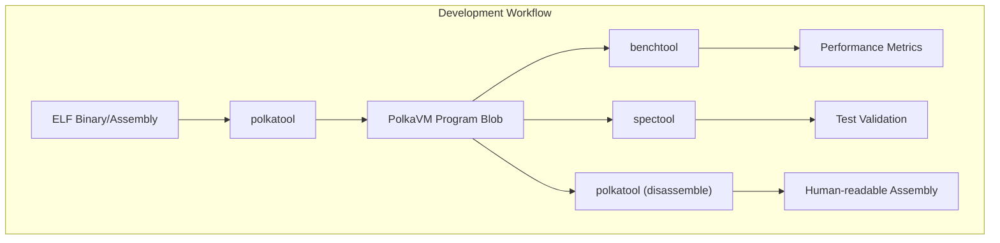
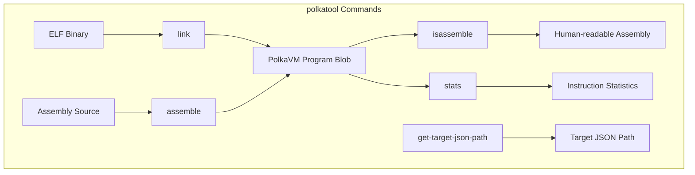
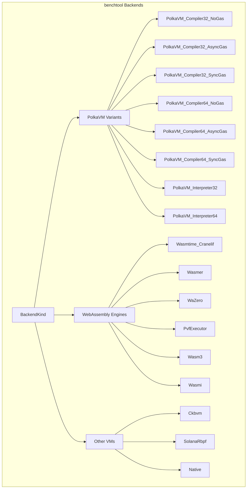
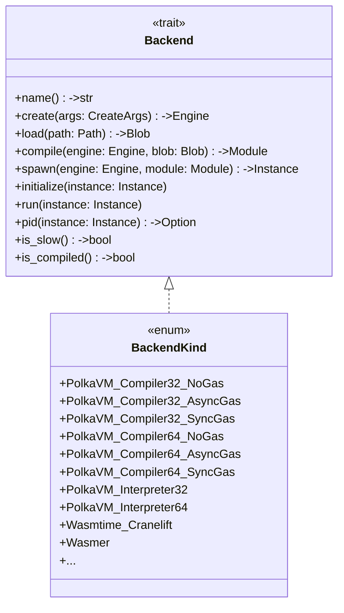
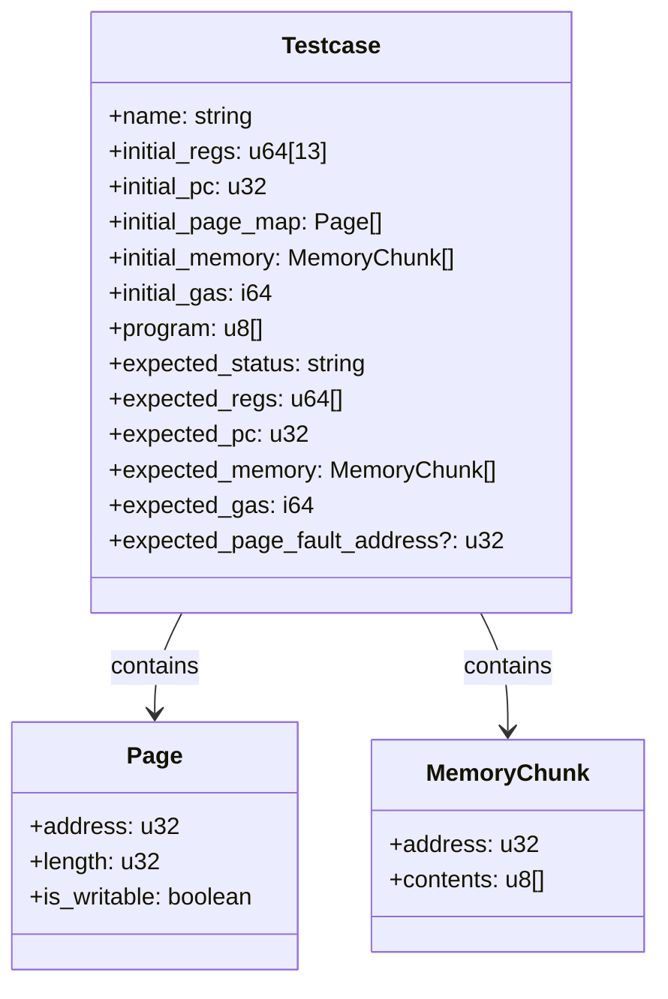
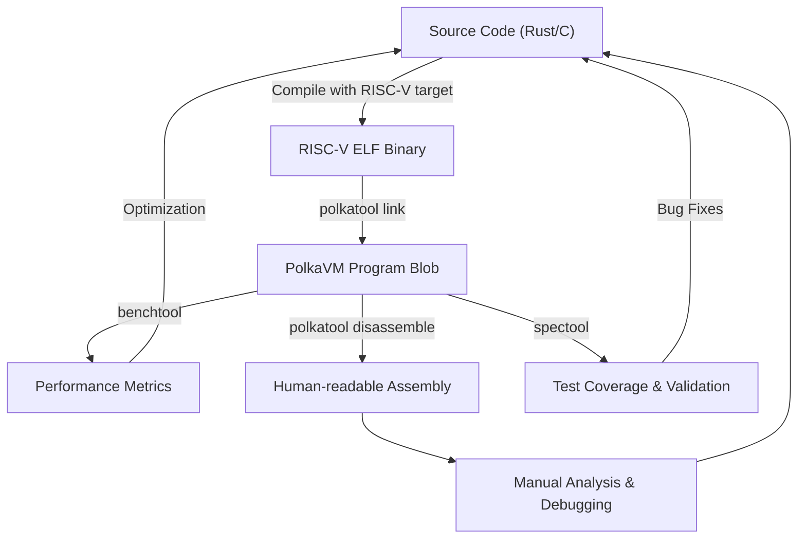

This article documents the command-line tools and utilities provided by the PolkaVM project to help developers work with PolkaVM programs. These tools facilitate the compilation, disassembly, analysis, benchmarking, and testing of PolkaVM applications.

## Overview

PolkaVM provides three main command-line utilities:

1. **polkatool** - A utility for working with PolkaVM programs (linking, disassembling, assembling)
2. **benchtool** - A benchmarking tool for comparing PolkaVM with other virtual machines
3. **spectool** - A test case generation and execution tool for verifying VM behavior

These tools complement each other in the development workflow and testing pipeline for PolkaVM applications.




## polkatool

`polkatool` is a versatile command-line utility for working with PolkaVM program blobs. It serves as a bridge between different program representations, allowing developers to convert ELF binaries to PolkaVM blobs, disassemble blobs into human-readable assembly, assemble text into blobs, and analyze blob statistics.

### Commands

`polkatool` supports the following subcommands:

| Command                | Description                                                 |
| ---------------------- | ----------------------------------------------------------- |
| `link`                 | Links a given ELF file into a `.polkavm` program blob       |
| `disassemble`          | Disassembles a `.polkavm` blob into human-readable assembly |
| `assemble`             | Assembles a `.polkavm` blob from human-readable assembly    |
| `stats`                | Calculates various statistics for given program blobs       |
| `get-target-json-path` | Writes a path to a JSON target file for rustc to stdout     |




### Link Command

The `link` command converts an ELF binary into a PolkaVM program blob. It offers several options to control the linking process:

```
polkatool link [OPTIONS] <input> -o <output>

```

Options:

* `-o, --output <PATH>`: The output file path (required)
* `-s, --strip`: Remove debug information
* `--disable-optimizations`: Disable optimizations
* `--run-only-if-newer`: Only run if the output doesn't exist or the input is newer
* `--min-stack-size <SIZE>`: Set the minimum stack size

Under the hood, the link command uses `polkavm_linker::program_from_elf()` to perform the conversion.

Sources: [tools/polkatool/src/main.rs137-181](https://github.com/paritytech/polkavm/blob/910adbda/tools/polkatool/src/main.rs#L137-L181)

### Disassemble Command

The `disassemble` command converts a PolkaVM program blob into human-readable assembly:

```
polkatool disassemble [OPTIONS] <input> [-o <output>]

```

Options:

* `-o, --output <PATH>`: The output file path (optional, defaults to stdout)
* `-f, --format <FORMAT>`: Disassembly format (Guest, GuestAndNative, Native, DiffFriendly)
* `--display-gas`: Show gas cost information
* `--show-raw-bytes`: Show raw instruction bytes

The disassembler can display code in different formats, including guest assembly, native machine code, or a combination of both.

Sources: [tools/polkatool/src/main.rs232-265](https://github.com/paritytech/polkavm/blob/910adbda/tools/polkatool/src/main.rs#L232-L265) [crates/polkavm-disassembler/src/lib.rs5-11](https://github.com/paritytech/polkavm/blob/910adbda/crates/polkavm-disassembler/src/lib.rs#L5-L11)

### Assemble Command

The `assemble` command creates a PolkaVM program blob from human-readable assembly:

```
polkatool assemble <input> -o <output>

```

Options:

* `-o, --output <PATH>`: The output file path (required)

The assembler takes a text file with PolkaVM assembly instructions and converts it into a binary program blob.

Sources: [tools/polkatool/src/main.rs267-286](https://github.com/paritytech/polkavm/blob/910adbda/tools/polkatool/src/main.rs#L267-L286) [crates/polkavm-common/src/assembler.rs166-938](https://github.com/paritytech/polkavm/blob/910adbda/crates/polkavm-common/src/assembler.rs#L166-L938)

### Stats Command

The `stats` command analyzes one or more program blobs and provides statistics about instruction usage:

```
polkatool stats <inputs>...

```

This command counts the occurrences of each instruction type and displays a sorted list of instructions by frequency.

Sources: [tools/polkatool/src/main.rs201-230](https://github.com/paritytech/polkavm/blob/910adbda/tools/polkatool/src/main.rs#L201-L230)

## benchtool

`benchtool` is a comprehensive benchmarking utility for comparing the performance of PolkaVM against other virtual machines. It supports various benchmarking methodologies and can generate detailed performance metrics.

### Benchmark Types

`benchtool` supports several types of benchmarks:

| Type          | Description                                                   |
| ------------- | ------------------------------------------------------------- |
| `runtime`     | Measures execution performance of a program (hot path)        |
| `compilation` | Measures the time needed to compile a program                 |
| `oneshot`     | Measures the end-to-end performance (compilation + execution) |

### Backends

`benchtool` can benchmark PolkaVM against multiple virtual machine implementations:




### Commands

`benchtool` provides several subcommands:

```
benchtool <SUBCOMMAND>

```

Subcommands:

* `criterion`: Runs benchmarks using the Criterion framework
* `benchmark`: Runs benchmarks directly
* `perf`: Runs the Linux `perf` tool for profiling a specific benchmark
* `bench-memset`: Benchmarks PolkaVM's memset implementation

### Benchmark Command

The `benchmark` command runs benchmarks and reports performance metrics:

```
benchtool benchmark [OPTIONS] [filter]

```

Options:

* `-i, --iteration-limit <N>`: Number of iterations to run
* `--forever`: Run benchmarks continuously
* `--aslr`: Run with Address Space Layout Randomization enabled

Sources: [tools/benchtool/src/main.rs408-632](https://github.com/paritytech/polkavm/blob/910adbda/tools/benchtool/src/main.rs#L408-L632)

### Perf Command

The `perf` command (Linux only) runs the Linux `perf` tool to profile a benchmark:

```
benchtool perf [OPTIONS] <command> [perf_args]...

```

Options:

* `-b, --benchmark <NAME>`: The benchmark to run
* `-t, --time-limit <SECONDS>`: The time limit for profiling
* `-i, --iteration-limit <N>`: Number of iterations to run

This command is useful for in-depth performance analysis and identifying hotspots in the code.

Sources: [tools/benchtool/src/main.rs634-723](https://github.com/paritytech/polkavm/blob/910adbda/tools/benchtool/src/main.rs#L634-L723)

### Backend Architecture

`benchtool` uses a trait-based architecture to support multiple VM backends:




For each backend, `benchtool` implements a consistent interface that allows it to create an engine, load a program, compile it, spawn an instance, and execute it. This design makes it easy to add new backends and ensures fair comparisons between different VMs.

Sources: [tools/benchtool/src/backend.rs14-29](https://github.com/paritytech/polkavm/blob/910adbda/tools/benchtool/src/backend.rs#L14-L29) [tools/benchtool/src/backend.rs233-299](https://github.com/paritytech/polkavm/blob/910adbda/tools/benchtool/src/backend.rs#L233-L299)

## spectool

`spectool` is a utility for generating and executing test cases for PolkaVM. It helps validate the correctness of the VM by creating test programs and verifying their execution results.

### Commands

`spectool` supports two main subcommands:

```
spectool <SUBCOMMAND>

```

Subcommands:

* `generate`: Generates test cases
* `test`: Runs test cases

### Generate Command

The `generate` command creates test cases based on either RISC-V test programs or custom assembly files:

```
spectool generate

```

This command:

1. Locates test source files in the `spec/src` directory
2. Assembles each test program into a PolkaVM blob
3. Executes the program to determine its expected behavior
4. Generates JSON test case files in the `spec/output/programs` directory
5. Creates a human-readable index of test cases in `spec/output/TESTCASES.md`

Sources: [tools/spectool/src/main.rs137-608](https://github.com/paritytech/polkavm/blob/910adbda/tools/spectool/src/main.rs#L137-L608)

### Test Case Format

Test cases follow a well-defined schema, described in both JSON Schema and ASN.1 formats:




Each test case specifies:

* Initial state (registers, program counter, memory, gas)
* Program to execute
* Expected final state
* Expected termination status

The test case format is designed to be comprehensive and enable thorough testing of all VM features.

Sources: [tools/spectool/spec/schema.json1-98](https://github.com/paritytech/polkavm/blob/910adbda/tools/spectool/spec/schema.json#L1-L98) [tools/spectool/spec/schema.asn1-87](https://github.com/paritytech/polkavm/blob/910adbda/tools/spectool/spec/schema.asn#L1-L87)

## Integration of Tools in Development Workflow

These tools form a comprehensive ecosystem for working with PolkaVM programs. A typical development workflow might look like:




### Example: Debugging a PolkaVM Program

1. Compile a program to RISC-V ELF
2. Use `polkatool link` to create a PolkaVM blob
3. Use `polkatool disassemble` to analyze the program
4. Identify and fix issues in the source code
5. Repeat until the program works correctly

### Example: Benchmarking Performance

1. Compile a program to PolkaVM, WebAssembly, and native formats
2. Use `benchtool` to measure performance across different VMs
3. Analyze results to identify performance bottlenecks
4. Optimize the code and repeat

### Example: Validating VM Behavior

1. Create test cases using custom assembly or RISC-V test programs
2. Use `spectool generate` to create formal test cases
3. Use the test cases to verify VM correctness across implementations

## Summary

The PolkaVM tools and utilities provide a comprehensive set of capabilities for working with PolkaVM programs:

| Tool        | Primary Purpose      | Key Features                                 |
| ----------- | -------------------- | -------------------------------------------- |
| `polkatool` | Program manipulation | Linking, disassembly, assembly, analysis     |
| `benchtool` | Performance testing  | Cross-VM benchmarking, profiling, comparison |
| `spectool`  | Correctness testing  | Test case generation, execution validation   |

Together, these tools enable developers to build, analyze, optimize, and validate PolkaVM applications effectively.

Sources: [tools/polkatool/src/main.rs1-288](https://github.com/paritytech/polkavm/blob/910adbda/tools/polkatool/src/main.rs#L1-L288) [tools/benchtool/src/main.rs1-767](https://github.com/paritytech/polkavm/blob/910adbda/tools/benchtool/src/main.rs#L1-L767) [tools/spectool/src/main.rs1-613](https://github.com/paritytech/polkavm/blob/910adbda/tools/spectool/src/main.rs#L1-L613)
