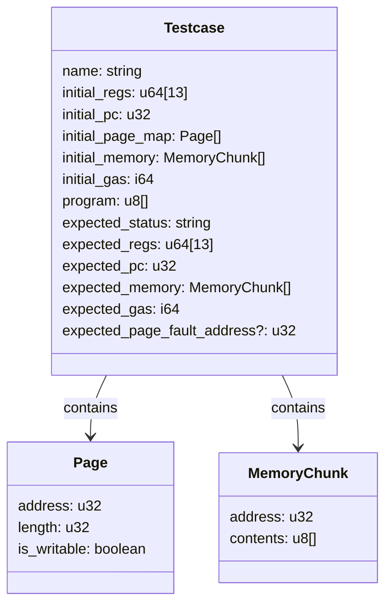
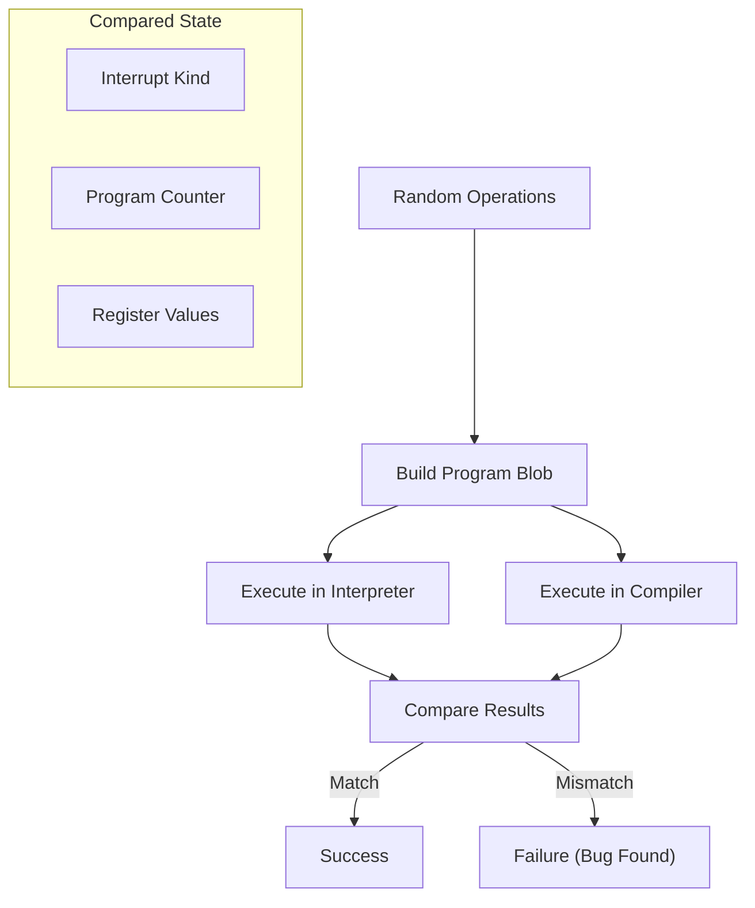
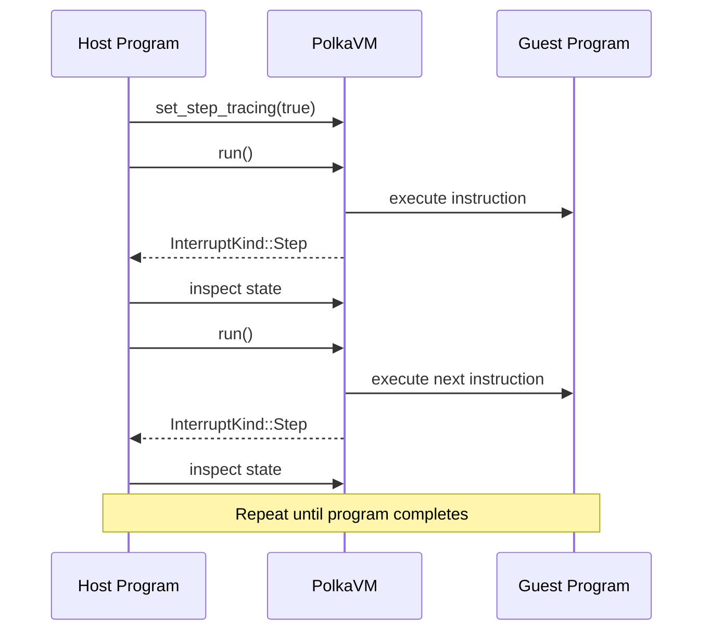
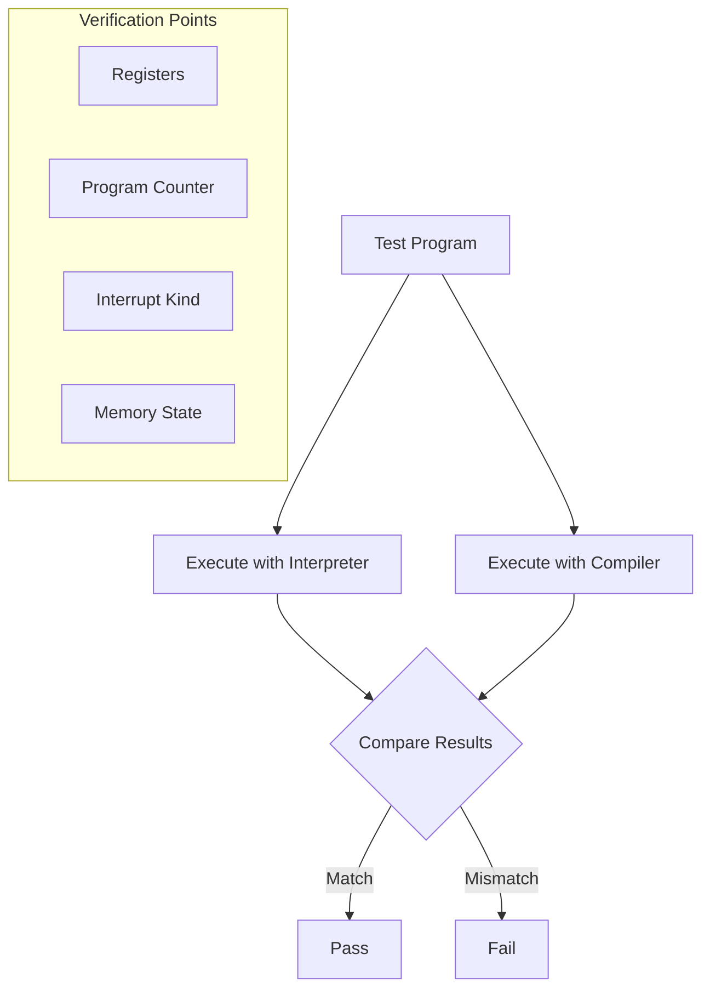

This article describes the testing and debugging infrastructure for PolkaVM, including automated test case generation, fuzzing capabilities, and tools for debugging VM execution. For information about benchmarking performance, see [Tools and Utilities](https://iurdao.github.io/technics/2025/05/28/Tools-and-Utilities.html).

## Test Specification Infrastructure

PolkaVM employs a comprehensive test specification framework that allows for defining test cases with precise initial conditions and expected outcomes. This infrastructure is primarily implemented via the `spectool` utility.

### Test Case Schema

Test cases are defined using a structured schema that specifies:

* Initial VM state (registers, memory, gas)
* Program to execute
* Expected final state after execution
* Expected execution status (halt, trap, page fault)

The schema is formally defined in both ASN.1 and JSON Schema formats:



Sources: [tools/spectool/spec/schema.json1-98](https://github.com/paritytech/polkavm/blob/910adbda/tools/spectool/spec/schema.json#L1-L98) [tools/spectool/spec/schema.asn1-87](https://github.com/paritytech/polkavm/blob/910adbda/tools/spectool/spec/schema.asn#L1-L87)

### Test Case Generation

The `spectool generate` command creates test cases by:

1. Loading assembly code or ELF files
2. Assembling them into program blobs
3. Executing them in a controlled environment
4. Recording state changes during execution
5. Generating JSON test case files
6. Creating a human-readable index (TESTCASES.md)


Sources: [tools/spectool/src/main.rs137-608](https://github.com/paritytech/polkavm/blob/910adbda/tools/spectool/src/main.rs#L137-L608)

### Pre/Post Directives

Test assembly files can include special directives to specify assertions about the initial and expected state:

```
pre: r1 = 42      # Set register r1 to 42 before execution
pre: gas = 10000  # Set initial gas to 10000

post: r2 = 84     # Expect register r2 to be 84 after execution
post: pc = @label[2] # Expect program counter to be at offset 2 from label

```

These directives are processed when generating test cases and verified during test execution.

Sources: [tools/spectool/src/main.rs97-134](https://github.com/paritytech/polkavm/blob/910adbda/tools/spectool/src/main.rs#L97-L134) [tools/spectool/src/main.rs173-186](https://github.com/paritytech/polkavm/blob/910adbda/tools/spectool/src/main.rs#L173-L186)

## Fuzzing Infrastructure

PolkaVM uses LibFuzzer to perform structured fuzzing of various components. Fuzzing helps find edge cases, vulnerabilities, and correctness issues by generating random but valid inputs.

### Fuzz Targets

The project includes several fuzzing targets:

| Target                   | Purpose                                                   |
| ------------------------ | --------------------------------------------------------- |
| `fuzz_shm_allocator`     | Tests the shared memory allocator                         |
| `fuzz_generic_allocator` | Tests the generic allocator                               |
| `fuzz_linker`            | Tests the linker by generating random RISC-V instructions |
| `fuzz_polkavm`           | Tests VM execution with randomly generated operations     |

Sources: [fuzz/Cargo.toml24-50](https://github.com/paritytech/polkavm/blob/910adbda/fuzz/Cargo.toml#L24-L50)

### VM Execution Fuzzing

The `fuzz_polkavm` target is particularly important as it tests the VM execution correctness by:

1. Generating random, but valid VM instructions
2. Building a program blob from these instructions
3. Executing the program in both interpreter and compiler backends
4. Comparing results to ensure identical behavior



Sources: [fuzz/fuzz\_targets/fuzz\_polkavm.rs539-617](https://github.com/paritytech/polkavm/blob/910adbda/fuzz/fuzz_targets/fuzz_polkavm.rs#L539-L617)

### Linker Fuzzing

The `fuzz_linker` target tests the linker by:

1. Generating random, but valid RISC-V instructions
2. Creating a minimal ELF file with these instructions
3. Passing the ELF file to the linker
4. Verifying that the linker processes it without crashing

This helps identify potential issues in the instruction transformation and optimization pipeline.

Sources: [fuzz/fuzz\_targets/fuzz\_linker.rs239-248](https://github.com/paritytech/polkavm/blob/910adbda/fuzz/fuzz_targets/fuzz_linker.rs#L239-L248)

## Debugging Capabilities

### Step Tracing

PolkaVM supports step-by-step execution tracing via the `step_tracing` option in `ModuleConfig`. When enabled, the VM generates `InterruptKind::Step` after executing each instruction, allowing for detailed execution analysis.




Sources: [tools/spectool/src/main.rs274](https://github.com/paritytech/polkavm/blob/910adbda/tools/spectool/src/main.rs#L274-L274)

### Disassembly

The PolkaVM disassembler provides tools to convert program blobs back to human-readable assembly code. The disassembler supports various options:

* Showing raw instruction bytes
* Using different register naming conventions
* Showing original or optimized instructions
* Displaying jump targets as offsets or labels

This is useful for debugging VM behavior and verifying code transformations.

Sources: [tools/spectool/src/main.rs427-438](https://github.com/paritytech/polkavm/blob/910adbda/tools/spectool/src/main.rs#L427-L438)

### Memory Inspection

The VM provides APIs to inspect and modify memory during execution:

* `read_memory` - Read contents from guest memory
* `write_memory` - Write data to guest memory
* `zero_memory` - Initialize memory regions with zeros
* `protect_memory` - Mark memory as read-only

These functions are useful for setting up test cases and inspecting execution results.

Sources: [tools/spectool/src/main.rs347-355](https://github.com/paritytech/polkavm/blob/910adbda/tools/spectool/src/main.rs#L347-L355) [tools/spectool/src/main.rs398-401](https://github.com/paritytech/polkavm/blob/910adbda/tools/spectool/src/main.rs#L398-L401)

## Correctness Testing

PolkaVM employs various strategies to ensure correctness:

### Backend Consistency Testing

The fuzzing infrastructure includes a cross-backend verification mode that:

1. Executes the same program in both interpreter and compiler backends
2. Compares final state (registers, memory, program counter)
3. Verifies consistent interrupt behavior
4. Reports any discrepancies as bugs

This ensures that both execution backends implement the same semantics.




Sources: [fuzz/fuzz\_targets/fuzz\_polkavm.rs584-601](https://github.com/paritytech/polkavm/blob/910adbda/fuzz/fuzz_targets/fuzz_polkavm.rs#L584-L601)

### RISC-V Tests

PolkaVM includes tests that verify compatibility with standard RISC-V test suites. These tests are included in the test case generation process:

```
// Extract RISC-V tests from the built-in test suite for line in include_str!("../../../crates/polkavm/src/tests_riscv.rs").lines() {  let prefix = "riscv_test!(riscv_unoptimized_rv64";  if !line.starts_with(prefix) {  continue;     }
 // Process test... }
```

These tests help ensure conformance to the RISC-V specification.

Sources: [tools/spectool/src/main.rs209-251](https://github.com/paritytech/polkavm/blob/910adbda/tools/spectool/src/main.rs#L209-L251)

## Testing Workflow

Here's an overview of the recommended testing workflow for PolkaVM development:

1. **Unit Tests**: Run the standard Rust test suite with `cargo test`
2. **Spec Tests**: Generate and run specification tests with `spectool generate` and `spectool test`
3. **Fuzzing**: Run fuzzing targets to find edge cases and bugs
4. **Cross-VM Testing**: Compare results with other RISC-V VMs using `benchtool`

For continuous testing during development, consider setting up automated test pipelines that include all these components.
