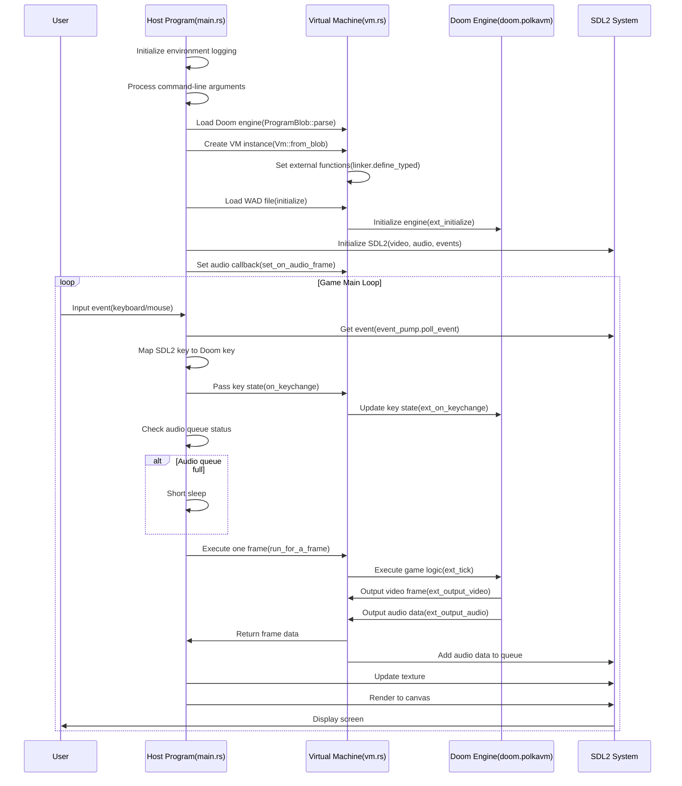
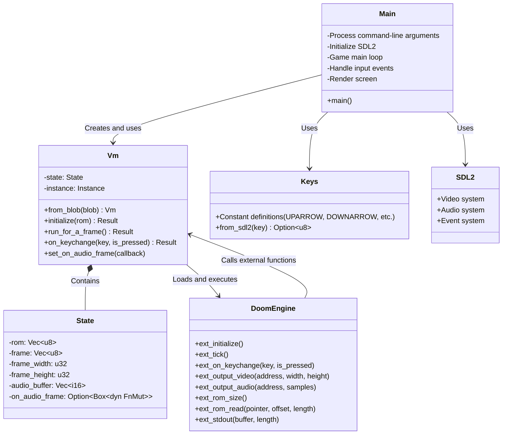

## Program Structure

The Polkavm github repo provides an example program that uses the PolkaVM virtual machine to run the classic game Doom. This program demonstrates how to use PolkaVM to execute complex game code while handling graphics rendering, audio output, and user input. This article aims to gain a glimpse into the mysteries of PolkaVM as the next-generation execution environment on the blockchain by analyzing the structure and runtime logic of this example program.

### File Structure

```
/examples/doom/
├── Cargo.toml         # Rust project configuration file
├── README.md          # Project description document
├── roms/              # Game ROM file directory
│   ├── README.md      # ROM file description
│   ├── doom-wad-shareware-license.txt  # Doom WAD file license
│   ├── doom.polkavm   # Doom engine binary compiled to PolkaVM format
│   ├── doom1.wad      # Doom game data file
│   └── relink.sh      # Relink script
└── src/               # Source code directory
    ├── keys.rs        # Key mapping definition
    ├── main.rs        # Main program entry point
    └── vm.rs          # PolkaVM virtual machine interface implementation
```

### Core Components

1. **Main Program (main.rs)**
   *   Responsible for initializing the environment, loading game ROMs and the engine.
   *   Sets up the SDL2 graphics and audio system.
   *   Handles user input.
   *   Implements the game main loop.
2. **Virtual Machine Interface (vm.rs)**
   *   Defines the `Vm` struct, encapsulating the PolkaVM instance.
   *   Implements the interface for interacting with the virtual machine.
   *   Defines external functions for the Doom engine to call (video output, audio output, ROM reading, etc.).
3. **Key Mapping (keys.rs)**
   *   Defines key constants used by Doom.
   *   Provides a mapping function from SDL2 keys to Doom keys.
4. **ROM Files**
   *   `doom.polkavm`: Doom engine compiled into PolkaVM format.
   *   `doom1.wad`: Doom game data file (freely distributed shareware version).

## Execution Flow

### Initialization Phase

1. Initialize the environment logging system.
2. Process command-line arguments, which can optionally override the default program and ROM files.
3. Load the Doom engine binary file (`doom.polkavm`).
4. Create a PolkaVM virtual machine instance.
5. Load the Doom game data file (`doom1.wad`).
6. Initialize SDL2 graphics, audio, and event systems.
7. Set up the audio callback function.

### Game Main Loop

1. **Event Handling**
   *   Handle SDL2 events (keyboard, mouse input).
   *   Map SDL2 keys to Doom keys.
   *   Pass the key state to the virtual machine via `vm.on_keychange()`.
2. **Audio Processing**
   *   Check the audio queue status.
   *   If there is insufficient audio data in the queue, continue the game loop.
   *   Otherwise, sleep briefly to avoid excessive CPU usage.
3. **Game Frame Update**
   *   Call `vm.run_for_a_frame()` to execute one frame of the Doom engine.
   *   Get the frame image data generated by the engine.
4. **Rendering**
   *   Clear the canvas.
   *   Update the SDL2 texture.
   *   Render the texture to the canvas.
   *   Present the screen.

### Interaction between Virtual Machine and Host

The Doom engine (client program) interacts with the host machine through the following interfaces:

1. **Video Output**: `ext_output_video`
   *   The engine passes the rendered frame data to the host machine.
   *   The host machine stores the data and prepares it for display.
2. **Audio Output**: `ext_output_audio`
   *   The engine generates audio samples and passes them to the host machine.
   *   The host machine adds the audio data to the SDL2 audio queue.
3. **ROM Access**: `ext_rom_size` and `ext_rom_read`
   *   The engine queries the ROM size and reads ROM data.
   *   The host machine provides access to the WAD file.
4. **Standard Output**: `ext_stdout`
   *   The engine can write data to the host machine's standard output.
5. **Key Input**: `ext_on_keychange`
   *   The host machine passes user input events to the engine.

## Sequence Diagram



## Structure Diagram



## Running Environment

This example program supports running on different operating systems:

1. **Linux**: Requires SDL2 to be installed, run using the command `cargo run --release --no-default-features`.
2. **macOS**: Requires specific environment variable settings, the command is:
   ```
   LIBRARY_PATH="$LIBRARY_PATH:$(brew --prefix)/lib" POLKAVM_ALLOW_INSECURE=1 POLKAVM_SANDBOX=generic POLKAVM_BACKEND=compiler cargo run --target=x86_64-apple-darwin --release
   ```
3. **Other Operating Systems**: Can run, but will use interpreter mode, which is slower.

## Summary

This Doom example demonstrates the powerful capabilities of PolkaVM, being able to run a complex game engine while handling graphics, audio, and input. The program adopts a clear modular design, encapsulating virtual machine operations in a dedicated module, with the main program responsible for handling SDL2 interaction and the game loop. By defining external function interfaces, efficient communication between the Doom engine within the virtual machine and the host environment is achieved.